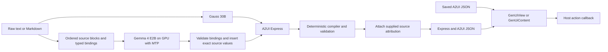

# GenUICraft Android SDK

GenUICraft converts Markdown or plain response text into A2UI Express, compiles it to the pinned A2UI v0.9 wire JSON, and renders native Android UI. Conversion and rendering are independent. The supported catalog is extracted from the A2UI test app; the SDK does not depend on that application's Activities or settings.

The renderer comes from `A2UI/android/app/src/main/java/com/samsung/genuicraft/renderer`, including `FlatSpecRenderer.kt`, `GenUiNativeRenderer.kt`, and the flat/native component implementations. Its Express/wire compiler, catalog and validation dependencies come from the app's sibling `pipeline` package. The extracted code and required resources are relocated under the SDK, with an SDK-owned theme wrapper. `GenUiContent` wraps that native rendering path; `GenUiView` adds an Android View and scrolling. The reference app consumes the published AAR. Renderer corrections made during extraction are recorded in [VALIDATION.md](VALIDATION.md).

The subsequent [renderer visual review](validation/20260918_visual/REPORT.md) adds consistent content margins, light/dark colors, clearer headings and list markers, compact responsive schedule cards, and readable column-aligned tables. These changes retain the accepted model prompts and source content.



## Build and consume

Requirements: JDK 17+, Android SDK 35, and an `ANDROID_HOME` pointing to the SDK. Gradle uses AGP 8.7.3 and Kotlin 2.2.21.

```powershell
.\gradlew.bat :genuicraft:testDebugUnitTest :genuicraft:publishReleasePublicationToLocalBuildRepository
```

The AAR is at `genuicraft/build/outputs/aar/genuicraft-release.aar`. The distributable Maven repository is `build/repo`. Copy this repository to the consumer and declare:

```kotlin
// settings.gradle.kts
dependencyResolutionManagement {
    repositories {
        google()
        mavenCentral()
        maven { url = uri("aars/genuicraft-maven") }
    }
}
// consumer module
implementation("com.samsung.genuicraft:genuicraft:0.3.0")
```

Version 0.3.0 adds typed recovery classification to successful conversions and
the safe exact-source fallback. Rebuild consumer code when upgrading; do not
replace an older-version binary at the same Maven coordinate. The trained W4 profile's measured results are in the
[12-case device pilot](validation/20260919_e2b_v10_w4/REPORT.md).

Use the Maven POM/module metadata: an AAR copied alone does not automatically install Compose, Coil, Gson, OkHttp, coroutines or LiteRT dependencies. Keep Gemma model weights external to the AAR. Renderer-only calls never initialize a model, though the combined artifact declares its runtime dependency.

Consumers need `minSdk = 26` or newer. To call the composable `GenUiContent`, enable Compose and apply the Kotlin Compose compiler plugin in the consumer module. A `GenUiView` host does not need to author composables; attach it inside a lifecycle-aware Activity or Fragment view tree, as required by its internal `ComposeView`.

During local development, rebuilding an unchanged version requires refreshing the consumer's Gradle dependencies (`--refresh-dependencies`) after copying the complete publication. Use a new version for subsequent releases.

## Convert with Gauss

```kotlin
val provider = Gauss30bProvider(GaussConfig())
val converter = GenUiConverter(context, provider)
// Launch from a lifecycle-owned coroutine; cancellation aborts outstanding work.
when (val result = converter.convert(GenUiRequest(
    text = perplexityResponse,
    query = originalQuery,
    sources = listOf(GenUiSource("7", "https://www.who.int/", "Source title")),
))) {
    is GenUiConversionResult.Success -> genUiView.render(result.document)
    is GenUiConversionResult.Failure -> showRetry(result.message)
}
// Close at the end of the owner lifecycle, not after every response.
provider.close()
```

Gauss defaults to `https://gaussa.post-train.win/v1/chat/completions`, model `gaussa-30b-v0.5-128k`, reasoning strength `low`. Endpoint, model, credential and timeout are injectable. Credentials are not embedded. SSE reasoning is excluded from output and incomplete/truncated completions fail validation.

## Convert on device

```kotlin
val provider = Gemma4Provider(Gemma4Config(
    modelPath = "/path/accessible/to/your/app/gemma-4-E2B-it.litertlm",
    accelerator = "GPU",
    enableSpeculativeDecoding = true,
    enableThinking = true,
))
val converter = GenUiConverter(context, provider)
```

### Trained E2B v10 W4 option

The SDK test screen also offers **Trained E2B v10 · W4 · GPU**. Place the separate
model at the displayed app-accessible path, normally
`Android/data/com.samsung.genuicraft/files/sdk_models/e2b_v10_w4.litertlm`.
The model stays outside the APK/AAR. Its selection and path are persisted
separately from the official E2B model and download settings.

```kotlin
val provider = Gemma4Provider(Gemma4Config(
    modelPath = trainedModelPath,
    accelerator = "GPU",
    maxContextTokens = 8192,
    maxOutputTokens = 2048,
    enableThinking = false,
    thinkingTokenBudget = 0,
    enableSpeculativeDecoding = false,
    enableMetrics = true,
))
val converter = GenUiTrainedConverter(context, provider)
val result = converter.convert(GenUiRequest(perplexityResponse))
```

This profile uses the full production training contract, one user/model worked
example, and the complete response text. It does not use the official model's
source bindings. The snapshot is pinned in `e2b_v10_shared_prompt.json`; verify
parity with the current training workflow using
`python GenUICraft/tools/sync_trained_prompt.py --check` from the A2UI root.
The supplied v10 export has mixed W4/W8 weights and no MTP drafter; newer exports
may carry their own runtime metadata. Thinking remains profile-controlled. The
trained converter makes one generation attempt. It accepts unchanged or bounded
syntax-repaired output only after mechanical source-preservation checks; otherwise
it returns a deterministic typed A2UI document built from exact source blocks.
`GenUiConversionResult.Success.repairKind` identifies `SOURCE_TEXT_FALLBACK`
directly, so fallback rendering is never reported as successful model generation.

LiteRT-LM 0.16.1 is required for this export's dynamic prefill dimensions.
Version 0.15 schedules prefill from dimensions read before GPU compilation and
can fail with a 130-token/128-row embedding mismatch. The upgrade leaves the
model weights and embedded chat template unchanged. A conversation-scoped adapter
unwraps Android text parts; the SDK verifies its rendered prompt bytes match the
training prefix before inference. Device results and prompt
provenance limits are recorded in the
[trained W4 Bixby50 report](validation/20260919_e2b_v10_w4/REPORT.md).

### Official E2B profile

The runtime initializes lazily and is reused. Keep the provider for the owner's lifetime and call `provider.close()` when that owner is destroyed. This is nonblocking; await `provider.closeAndAwait()` before constructing a replacement that requires the old engine to be fully released. The model must be accessible to the consumer app. GPU, MTP speculative decoding and thinking are enabled by default; the packaged GPU runtime requires `arm64-v8a`, and an incompatible MTP model fails clearly. The formatting prompt uses a 1,024-token thinking budget, configurable through `Gemma4Config.thinkingTokenBudget`. See [ON_DEVICE_RUNTIME.md](ON_DEVICE_RUNTIME.md) for the Gallery comparison, runtime/backend support and lifecycle details. Gemma has a separately versioned compact prompt in `genuicraft/src/main/assets/genuicraft/prompts/gemma.txt`.

The accepted v10 Gemma path segments source content conservatively into headings, paragraphs, lists, tables, code and dividers. It supplies ordered blocks, typed source-binding tokens, component names and the required root assignment. The model generates the complete Express program using those bindings, including each table's domain and presentation. The SDK inserts the exact original values before compilation, avoiding numeric copying errors. Missing, reordered, repeated or misused bindings and malformed Express fail validation and receive a bounded model repair. Failed inference is never replaced with a deterministic layout. Returned Express/JSON contains the actual content and needs no binding service to render.

`GenUiConverter.withPrompt` accepts a custom reviewed prompt. Pass `useSourceBindings=true` when that prompt uses the typed binding contract; the default is `false`. The accepted production API and bundled Gemma prompt do not supply a complete Express scaffold.

Ten new prompt/input strategies were evaluated separately from the baseline controls. The scaffold candidate was rejected after its full-corpus run finished at 48/50 successes, with two unrepaired failures and zero fallbacks. That study did not replace the accepted v10 conversion prompt. Later renderer and runtime changes have their own validation records. Research and candidate sources are retained under [the prompt study](experiments/gemma_prompt_study_20260918/REPORT.md).

In the test app, select **Gemma 4 E2B** and **Download model** to fetch the official
2.59 GB GPU+MTP package. The download continues through Android's download service
when the app is closed; reopening the SDK screen restores its progress. Cancel
and retry are available. The app checks the complete file size and pinned SHA-256
before showing the model as ready and enabling conversion. Once ready, it selects
the managed model automatically. **Use local file** remains available for an
existing export. These choices persist across app restarts.

The download is pinned to repository revision
`b3ca0d2f076785a8f4b2219ddbd2bdb99954eae1` of
`litert-community/gemma-4-E2B-it-litert-lm`; weights stay outside the APK/AAR.
See the [download and two-device validation](validation/20260918_model_download/REPORT.md)
for test evidence and the shared APK identity.

For command-line staging, `tools/stage_official_gemma.ps1 -Serial <adb-serial>`
streams the official package directly to the test app's external-files directory
and verifies the pinned SHA-256 on both the transfer and device file. Other SDK
consumers must provision their own accessible model path.

## Optional token metrics in the test app

Open **GenUICraft SDK · Bixby50** and use **Token metrics** to enable or disable
the measurements. The preference persists across app restarts and is enabled by
default in the demo. With Gemma, changing it takes effect on the next conversion
and recreates the engine as needed. The official profile keeps GPU, MTP, and
thinking enabled; the trained W4 profile keeps its GPU-only, no-thinking settings.

SDK hosts opt in with `Gemma4Config(enableMetrics = true, modelPath = modelPath)`.
Each `GenUiProvider.generate` result exposes nullable `metrics` with actual
`inputTokens`, `outputTokens`, and native `decodeTokensPerSecond`. Missing counters
remain unavailable. Native output counts include thinking work. Decode speed
excludes model startup and prompt prefill, so the demo also shows total conversion
time and each repair attempt separately. Gauss counts come from server usage;
its request-average speed includes network and server processing time and is
labelled separately. Renderer-only calls clear previous generation measurements.

See the [Fold7 metrics validation](validation/20260918_fold_metrics/REPORT.md) for
measured GPU+MTP speeds, on-device checks, screenshots, and installed APK identity.

## Render without conversion

```kotlin
val document = GenUiCompiler.compile(savedA2uiJson) // Or strict Express text.
genUiView.render(document)
genUiView.onAction = { action ->
    if (action.name == "openUrl") openReviewedWebLink(action.parameters.getValue("url"))
}
// Compose: the host supplies layout/scrolling.
GenUiContent(document = document, onAction = ::handleAction)
```

Generated output can opt into auditable recovery while keeping strict compilation
unchanged:

```kotlin
val outcome = GenUiCompiler.compileWithRepair(rawModelOutput, perplexityResponse)
when (outcome.repairKind) {
    GenUiRepairKind.NONE -> Unit
    GenUiRepairKind.STRUCTURAL -> log(outcome.diagnostics)
    GenUiRepairKind.SOURCE_TEXT_FALLBACK -> log("Model output rejected; exact source fallback used")
}
genUiView.render(outcome.document)
```

Bounded repair only removes a leading BOM or exact Markdown fence and can complete
a final `</a2ui` token when the enclosed program already passes the strict codec and
canonical validator. It does not balance expressions, drop properties or elements,
invent roots/IDs, fuzzy-correct values, or change visible content. The fallback maps
source headings, paragraphs, lists, tables, code and dividers to typed components
through source bindings, then passes the normal compiler and content-integrity gate.
Recovery rejects generated input above 120,000 characters, source text above
100,000 characters, more than 1,024 elements/statements, and expression or
reference nesting above 64 levels before recursive work can become unbounded.

`GenUiView` is an Android View wrapper with scrolling. `GenUiContent` is a composable for host-controlled layout. Local actions (`setState`, `pushState`, `removeState`, `validateForm`) execute in the renderer. External URL actions return `GenUiAction(name = "openUrl", parameters = mapOf("url" to url))`; successful `emitEvent` actions return the supplied event name and remaining parameters. A renderer-only application does not need provider credentials or model weights.

`genUiView.convertAndRender(converter, request)` is the convenience API. The caller controls loading, retries, cancellation and errors. Conversion runs off the main thread; the convenience API switches to the main thread for rendering.

## Contract and failure handling

- Output exposes both Express and JSON, with explicit profile/schema versions. `GenUiCompiler.compile()` accepts strict `<a2ui>` Express or supported A2UI v0.9 wire envelopes (object/array). It rejects legacy `{root,state,elements}` input. `a2uiJson` is a v0.9 message array using catalog `com.samsung.genuicraft.catalog.v1`; the renderer's internal canonical graph is not the public JSON format.
- Source text that resembles a state expression is escaped using the catalog's literal-string convention. It stays valid v0.9 JSON and replays literally in this renderer; see [LITERAL_TEXT_PROFILE.md](LITERAL_TEXT_PROFILE.md) before sending these exceptional values to another renderer.
- No LLM is used to compile Express to JSON. Invalid schemas, unresolved references or unsupported properties are rejected.
- `GenUiConverter` validates source wording, numeric facts, citation markers and supplied links. Mechanical preservation checks complement human review; they do not prove semantic correctness. `GenUiTrainedConverter` applies the same mechanical gate before accepting direct trained output.
- `GenUiConverter` bounds model repair and reports provider `attempts`. `GenUiTrainedConverter` makes one provider attempt, then uses local bounded syntax repair or a separately labeled source-bound fallback. Local recovery never increments the provider-attempt count.
- Citation markers without supplied URLs remain markers. The library does not invent source links.
- Supplied source IDs, titles and safe public HTTP(S) URLs are appended deterministically as source buttons. Unsupported or blocked source URLs fail before model execution. `GenUiConverter` also restricts model-generated actions to exact supplied links. Trained-model and renderer-only documents use the renderer's action policy and host callbacks; hosts must review external actions.
- Requests are bounded before serialization (100,000 text characters, 8,000 query characters, 100 sources and 110,000 combined characters). Transport responses are bounded before allocation, and server redirects are rejected.
- The host owns history, provider selection, model provisioning, permission decisions and external action execution.
- Conversion uses deterministic sampling by default (`temperature=0.0`). The optional request query is host context and is excluded from formatting prompts so its instructions cannot override preservation of the supplied answer.

## Validation in the A2UI test app

The parent `android` test app consumes the published AAR by Maven coordinate, not this library's source. Open **GenUICraft SDK · Bixby50** from its home screen to try either provider or renderer-only mode.

Instrumentation class: `com.samsung.genuicraft.GenUiSdkBixby50Test`. Arguments: `provider=gauss|gemma`, `modelPath`, `accelerator=GPU|CPU` (default GPU), `mtp=true` (default), `cases=BXP-001,BXP-038` (omit for all 50), `runId`, `repairs=1`, `caseTimeoutMs=600000`, `temperature=0.0`. Gemma's optional `thinkingBudget` overrides the SDK's 1,024-token default without disabling thinking. Optional `promptPath` loads a local prompt for development, with `sourceBindings=true` for a custom bound prompt; omit it for bundled-prompt acceptance. Artifacts are written to the app's external-files `sdk_benchmark/<runId>` directory. Each success is replayed through JSON-only rendering without another model call. Failures remain failures in reports. `tools/summarize_benchmark.py <pulled-run>` reports first-attempt successes, repaired successes, failures, timing, and whole-process PSS separately. Its `run_complete` flag requires the completion record and the full expected set of unique case IDs; partial results remain explicitly incomplete.

The test app's `-PgenUiSdkOnlyNative=true` build flag omits its legacy JNI files. Use this flag to verify the native runtime supplied by the SDK publication and its declared dependencies. Prompt studies may set `recordInputs=true` to save each effective input and `corpusPath` for a synthetic JSONL fixture. The experimental `inputScaffold=true` argument appends a test-provider scaffold to custom prompts; it is separate from the accepted v10 SDK behavior. Omit experimental scaffold arguments for production acceptance. The study's candidate-build metadata must not be interpreted as a production API or default.

For an independent renderer check, run `GenUiSdkBixby50Test#replaySavedBixbyCorpus` with `sourceRunId=<completed-run>` and a new `runId`. Omit `cases` to replay all 50. The default `replayMode=json` compiles saved JSON without changing its bytes. `replayMode=express` strictly compiles captured Express. `replayMode=express_repair` runs the explicit repair/fallback API and records its classification, diagnostics and recovered hashes. `replayMode=raw_model` revalidates captured successful Gemma output through the current converter. All replay modes report **zero live model calls**, save screenshots and accessibility hierarchies, and check table columns while scrolling. Repair/fallback replay is renderer evidence, not additional inference success or an improved model-quality score. Bounded viewport capture cannot prove that every pixel or row is correct.

`tools/probe_gauss.py` is a host prompt-development helper. Its results are explicitly separate from Android AAR acceptance results.

See `VALIDATION.md` for actual results and remaining integration limitations. Bixby source changes are in the supplied Bixby checkout; Bixby is not built here because its dependencies are unavailable.
