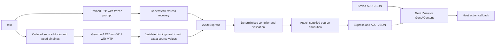

# GenUICraft Android SDK

GenUICraft converts Markdown or plain response text into A2UI Express, compiles it to the pinned A2UI v0.9 wire JSON, and renders native Android UI. Conversion and rendering are independent. The supported catalog is extracted from the A2UI test app; the SDK does not depend on that application's Activities or settings.

The renderer comes from `A2UI/android/app/src/main/java/com/samsung/genuicraft/renderer`, including `FlatSpecRenderer.kt`, `GenUiNativeRenderer.kt`, and the flat/native component implementations. Its Express/wire compiler, catalog and validation dependencies come from the app's sibling `pipeline` package. The extracted code and required resources are relocated under the SDK, with an SDK-owned theme wrapper. `GenUiContent` wraps that native rendering path; `GenUiView` adds an Android View and scrolling. The reference app consumes the published AAR. Renderer corrections made during extraction are recorded in [VALIDATION.md](VALIDATION.md).

The subsequent [renderer visual review](validation/20260918_visual/REPORT.md) adds consistent content margins, light/dark colors, clearer headings and list markers, compact responsive schedule cards, and readable column-aligned tables. These changes retain the accepted model prompts and source content.


```mermaid
flowchart LR
  text --> trained[Trained E2B with frozen prompt]
  trained --> recovery[Generated Express recovery]
  recovery --> express[A2UI Express]
  text --> bindings[Ordered source blocks and typed bindings]
  bindings --> gemma[Gemma 4 E2B on GPU with MTP]
  gemma --> bind[Validate bindings and insert exact source values]
  bind --> express
  express --> compiler[Deterministic compiler and validation]
  compiler --> attribution[Attach supplied source attribution]
  attribution --> document[Express and A2UI JSON]
  saved[Saved A2UI JSON] --> renderer[GenUiView or GenUiContent]
  document --> renderer
  renderer --> host[Host action callback]
```

## Build and consume

Requirements: JDK 17+, Android SDK 35, and an `ANDROID_HOME` pointing to the SDK. Gradle uses AGP 8.7.3 and Kotlin 2.2.21.

```powershell
.\gradlew.bat :genuicraft:testDebugUnitTest :genuicraft:publishReleasePublicationToLocalBuildRepository
```

The AAR is at `genuicraft/build/outputs/aar/genuicraft-release.aar`. The distributable Maven repository is `build/repo`. Copy this repository to the consumer and declare:

```kotlin
// settings.gradle.kts
dependencyResolutionManagement {
    repositories {
        google()
        mavenCentral()
        maven { url = uri("aars/genuicraft-maven") }
    }
}
// consumer module
implementation("com.samsung.genuicraft:genuicraft:0.6.0")
```

Version 0.5.0 removes the remote server provider and its public configuration API.
Conversion uses the SDK's on-device LiteRT model profiles.

Version 0.6.0 adds progressive native rendering through `GenUiSession`,
`GenUiGenerationObserver.onRenderSnapshot`, `GenUiStreamingContent`, and
`GenUiView.renderSnapshot`. The SDK compiles safe portions of cumulative model
output in a separate worker while inference continues. The final document still
passes the selected conversion and repair policy. The reference demos show the
live native UI by default and keep generated/repaired IR available for inspection.
See the [streaming-rendering validation](validation/20261008_streaming_rendering/REPORT.md)
for SDK/device tests, the saved-output replay, five native paired comparisons,
byte-hash parity, and timing limitations; the [gallery](validation/20261008_streaming_rendering/index.html)
shows the captured live and final native UI.

Version 0.5.7 recognizes combined flight-time ranges such as `04:40–07:10` in
the shared native flight-card route, including explicit AM/PM and next-day offsets.
Duration and stops can share a Details cell; source citations and dates remain
visible without turning citation IDs into booking URLs. Page-level nested layout
wrappers no longer add horizontal padding on top of the host gutter. Vertical
spacing, card interiors and side-by-side cells retain their layout, and flight
cards use 10 dp of horizontal content padding.
See the [flight and spacing verification](validation/20260930_flight_ranges_padding/REPORT.md)
for unchanged-document device replays, measured bounds and the Bixby handoff.

Version 0.5.6 improves generated Express recovery and comparison presentation.
Opt-in generated-output repair reconnects static answer components omitted from the
root, preserves usable generated table labels and column order, and keeps guarded
UI templates dormant. Comparison cards put prices and other requested highlights
first while long fields use readable labeled detail rows. These changes preserve
generated content; they cannot restore facts or citations the model never produced.
One-column tables now display their generated values, and long explanatory text
mistagged as a heading uses body typography. Ranked text rows use entity cards;
metric cards retain every nonblank field and its label instead of dropping
additional columns. See the
[Bixby50 presentation and recovery review](validation/20260929_bixby50_presentation/REPORT.md)
for the saved-output device comparison and its source-fidelity limits.

Version 0.5.5 adds `GenUiView.embeddedMode` for answers inside a host-owned
scrolling conversation. Set it before `render` and use `onContentSizeChanged`
to reserve the measured pixel height in the parent. Embedded content has no
internal vertical scroll container, no extra horizontal outer padding, and a
transparent background. The host forwards vertical drags to its conversation;
taps and horizontal controls remain interactive. Standalone views retain their
existing scroll container and padding. Railway comparisons that supply travel
time and fare without departure/station columns now use compact train rows.
See the [embedded Bixby layout report](validation/20260929_expanded_bixby_layout/REPORT.md)
for device measurements, compact train screenshots and merge-delivery details.
The Bixby host also uses the existing SDK streaming observer for early selectors,
button progress, live Express and measured native handoff; see the
[streaming-controls validation](validation/20260929_bixby_streaming_controls/REPORT.md).

Version 0.5.4 replaces experimental Compose `FlowRow` calls with an SDK-owned
wrapping layout. This avoids the missing older `FlowRowOverflow` method signature
when a host resolves newer Compose libraries. The layout retains wrapping,
spacing, RTL placement and weighted metric cards. Validate the published AAR with
`python tools/check_compose_flow_abi.py genuicraft/build/outputs/aar/genuicraft-release.aar`
and test consumers with their actual Compose dependency versions.
See the [0.5.4 compatibility report](validation/20260929_compose_compat/REPORT.md)
for the reproduced Bixby crash, artifact checks and device evidence.

Version 0.5.3 replaces spacious train tickets with compact grouped rows, wrapping
labeled details and thin separators. Clear railway tables with generic detail
headings such as `Journey` also use this route. Supplied values and inline source
previews are preserved. The [device visual check](validation/20260929_compact_railway/REPORT.md)
measured a 36% shorter three-train block at the same font size.

Version 0.5.2 adds citation previews and a collapsible Sources section. Host-provided
source IDs, titles, URLs and optional descriptions are stored in the compiled document.
Tapping a known citation opens its details; only **Open website** invokes the host's
URL callback. Source excerpts are not sent to the formatting model. Hosts with their
own source controls can pass `showSources = false` to `GenUiContent`, or set
`GenUiView.showSources = false` before rendering; citation previews remain enabled.

Version 0.4.2 refines the train cards with compact ticket styling, full-width departure times,
and wrapping duration/seating details. See the [Fold7 visual check](validation/20260922_train_card_polish_fold7/REPORT.md).

Version 0.4.1 adds [native train-comparison cards](validation/20260922_train_comparison_fold7/REPORT.md),
including readable field labels, prominent departure times and full generated-value preservation.

Version 0.4.0 adds `GenUiSession`, which owns conversion profile selection, raw streaming
capture, recovery, prompt/runtime measurements, and cancellation-safe cleanup. The SDK
also owns `LiteRtModelRunner`, the reusable engine/cache and native inference path for
the official E2B and Gemma 3 profiles. Demo views only select settings and display results.
Rebuild consumer code when upgrading; do not
replace an older-version binary at the same Maven coordinate. The trained W4 profile's measured results are in the
[12-case device pilot](validation/20260919_e2b_v10_w4/REPORT.md).

Use the Maven POM/module metadata: an AAR copied alone does not automatically install Compose, Coil, Gson, OkHttp, coroutines or LiteRT dependencies. Keep Gemma model weights external to the AAR. Renderer-only calls never initialize a model, though the combined artifact declares its runtime dependency.

Consumers need `minSdk = 26` or newer. To call the composable `GenUiContent`, enable Compose and apply the Kotlin Compose compiler plugin in the consumer module. A `GenUiView` host does not need to author composables; attach it inside a lifecycle-aware Activity or Fragment view tree, as required by its internal `ComposeView`.

During local development, rebuilding an unchanged version requires refreshing the consumer's Gradle dependencies (`--refresh-dependencies`) after copying the complete publication. Use a new version for subsequent releases.

## Convert on device

```kotlin
val provider = Gemma4Provider(Gemma4Config(
    modelPath = "/path/accessible/to/your/app/gemma-4-E2B-it.litertlm",
    accelerator = "GPU",
    enableSpeculativeDecoding = true,
    enableThinking = true,
))
val converter = GenUiConverter(context, provider)
```

### Shared trained E2B pipeline for every host

Use the session API in SDK demos, IR/Pipeline views, and Bixby. Its trained profile uses
the frozen prompt and best-effort recovery of the generated DSL, without replacing it
with source text. Raw streamed IR is retained separately from repaired IR and compiled
A2UI. Recovery does not guarantee that generated values match the source; fidelity
diagnostics remain in the result warnings.

```kotlin
val provider = Gemma4Provider(GenUiModelProfiles.trainedE2b(
    modelPath = trainedModelPath,
    enableMtp = true, // Use only with the newer mobile package containing a drafter.
    enableMetrics = true,
))
val session = GenUiSession(context, provider, GenUiConversionProfile.TRAINED_E2B_V10_W4)
val result = session.convert(
    GenUiRequest(text = markdownOrPlainResponse),
    GenUiGenerationObserver(onPartialText = { attempt, raw ->
        // Worker-thread callback: post the raw generation to your optional debug view.
    }),
)
val nativeAttempts = session.attemptSnapshots // Exact raw text, prompt, metrics, runtime.
when (result) {
    is GenUiConversionResult.Success -> genUiView.render(result.document)
    is GenUiConversionResult.Failure -> showRetry(result.message)
}
// At the end of the owner lifecycle, before constructing another native engine:
session.closeAndAwait()
```

Since 0.5.1, the shared trained profile uses GPU FP32 execution to mitigate the
observed FP16 accuracy loss. The library prepares a reusable metadata-only model
copy (~2.6 GB extra storage on first use); quantized weights and the source file
stay unchanged. Debug runtime names include `GPU+FP32` and retain the MTP status.
See [GPU precision and cache behavior](ON_DEVICE_RUNTIME.md#trained-model-gpu-precision-051).

The same session supports the official source-bound route through
`GenUiConversionProfile.SOURCE_BOUND` and the trained model route through its dedicated profile. Model discovery, UI preferences, host actions,
and dispatching callbacks to the UI thread remain host responsibilities. Low-level
consumers of other local models can use `LiteRtModelRunner`; its accelerator policy,
engine cache, conversation/template handling, native token measurements and explicitly
labelled estimates are library-owned. The reference app's `OnDeviceLitertBackend` is
only an adapter to that API.

### Progressive native rendering

Register `onRenderSnapshot` on the session observer to receive native rendering
revisions. Each `GenUiRenderSnapshot` contains a compiled `document`, `attempt`,
monotonic `revision`, `surfaceKey`, `elapsedMs`, `readyComponentCount`, and
`isFinal`. The surface key stays the same from preview to final within an attempt;
another attempt or conversion gets a new key. The component count includes
layout containers; it is not a count of visible cards. `elapsedMs` measures
session conversion start to publication, including runtime preparation, rather
than first screen paint.

The worker accepts completed component expressions and complete entries from
bound data arrays, then validates a separate renderable projection. Unfinished
strings, missing references, and pending data stay out of that projection. It
preserves usable generated content and identities without modifying the raw
attempt capture or inventing facts. Preview work is coalesced off the native
decode callback, so hosts need not receive every token-sized revision. Some
outputs may produce no usable preview before final validation.

Callbacks must return promptly and dispatch UI updates to the main thread.
Track the current run and attempt so queued updates cannot overwrite a new run,
failure, or cancellation. A host can keep the last safe preview visible while a
repair attempt waits for its first usable component, then accept only snapshots
from the current attempt. An Android View host can use the following pattern;
the example runs in its main-thread lifecycle coroutine, and `generationRun` is
host-owned main-thread state:

```kotlin
val main = Handler(Looper.getMainLooper())
val run = ++generationRun
var activeAttempt = 0
genUiView.clear()
val observer = GenUiGenerationObserver(
    onAttemptStarted = { attempt ->
        main.post { if (generationRun == run) activeAttempt = attempt }
    },
    onPartialText = { attempt, raw ->
        main.post { if (generationRun == run) showRawIr(attempt, raw) }
    },
    onRenderSnapshot = { snapshot ->
        main.post {
            if (generationRun == run && snapshot.attempt == activeAttempt) {
                genUiView.renderSnapshot(snapshot)
            }
        }
    },
)
try {
    val result = session.convert(
        GenUiRequest(text = markdownOrPlainResponse), observer,
        enableStreamingRendering = streamUi,
    )
    if (generationRun == run) when (result) {
        is GenUiConversionResult.Success -> {
            markConversionComplete(result) // Persist result.document, not a preview.
            if (!streamUi) genUiView.render(result.document)
        }
        is GenUiConversionResult.Failure -> {
            ++generationRun
            genUiView.clear()
            showRetry(result.message)
        }
    }
} catch (cancelled: CancellationException) {
    if (generationRun == run) {
        ++generationRun
        genUiView.clear()
    }
    throw cancelled
}
```

Compose hosts keep the accepted snapshot in their retained UI state and render
it at a stable position. Update that state on the main thread using the same
run/attempt guards:

```kotlin
currentSnapshot?.let { snapshot ->
    GenUiStreamingContent(
        snapshot = snapshot,
        modifier = Modifier.fillMaxWidth(),
        onAction = ::handleAction,
        showSources = true,
    )
}
```

Both streaming render APIs preserve native surface state, scrolling, and source
disclosure across revisions of the same surface key. `GenUiView` rejects older
revisions and provisional updates after finalization for that key. Generated
control events, form edits, state mutations, navigation actions, and watches remain
inactive while `isFinal == false`. Host-supplied citation/source disclosure keeps
its own behavior. Finalization enables the accepted document's interactions.

Keep loading active until `session.convert` returns its authoritative result.
The accepted final snapshot is emitted after full compilation/repair and metrics
finalization, before a successful call returns, and contains the same document
as `GenUiConversionResult.Success`. Repair can change the final structure;
partial rendering does not establish conversion success or source fidelity.
On failure or cancellation, invalidate queued callbacks and discard the preview.
Persist only successful result documents and retain the separate raw attempts
and repair warnings for diagnostics.

`enableStreamingRendering` defaults to `true`. Passing `false` suppresses all
render snapshots, including the final callback, while raw streaming, prompts,
conversion, and repair remain unchanged. Render `result.document` normally in
that mode. Without an `onRenderSnapshot` observer, the session does not run the
preview compiler. This lets hosts compare inference throughput with rendering
enabled and disabled using the same conversion policy.

### Original trained E2B v10 W4 option

The SDK test screen also offers **Trained E2B v10 · W4 · GPU**. Place the separate
model at the displayed app-accessible path, normally
`Android/data/com.samsung.genuicraft/files/sdk_models/e2b_v10_w4.litertlm`.
The model stays outside the APK/AAR. Its selection and path are persisted
separately from the official E2B model and download settings.

```kotlin
val provider = Gemma4Provider(Gemma4Config(
    modelPath = trainedModelPath,
    accelerator = "GPU",
    maxContextTokens = 8192,
    maxOutputTokens = 2048,
    enableThinking = false,
    thinkingTokenBudget = 0,
    enableSpeculativeDecoding = false,
    gpuPrecision = Gemma4GpuPrecision.FP32,
    enableMetrics = true,
))
val converter = GenUiTrainedConverter(context, provider)
val result = converter.convert(GenUiRequest(perplexityResponse))
```

This profile uses the full production training contract, one user/model worked
example, and the complete response text. It does not use the official model's
source bindings. The snapshot is pinned in `e2b_v10_shared_prompt.json`; verify
parity with the current training workflow using
`python GenUICraft/tools/sync_trained_prompt.py --check` from the A2UI root.
The original supplied v10 export has mixed W4/W8 weights and no MTP drafter, so
the example above disables MTP. The newer mobile export includes a drafter;
use `enableSpeculativeDecoding = true` for that package. Thinking remains profile-controlled. The
trained converter makes one generation attempt. It accepts unchanged or bounded
syntax-repaired output only after mechanical source-preservation checks; otherwise
it returns a deterministic typed A2UI document built from exact source blocks.
`GenUiConversionResult.Success.repairKind` identifies `SOURCE_TEXT_FALLBACK`
directly, so fallback rendering is never reported as successful model generation.

LiteRT-LM 0.16.1 is required for this export's dynamic prefill dimensions.
Version 0.15 schedules prefill from dimensions read before GPU compilation and
can fail with a 130-token/128-row embedding mismatch. The upgrade leaves the
model weights and embedded chat template unchanged. A conversation-scoped adapter
unwraps Android text parts; the SDK verifies its rendered prompt bytes match the
training prefix before inference. Device results and prompt
provenance limits are recorded in the
[trained W4 Bixby50 report](validation/20260919_e2b_v10_w4/REPORT.md).

### Official E2B profile

The runtime initializes lazily and is reused. Keep the provider for the owner's lifetime and call `provider.close()` when that owner is destroyed. This is nonblocking; await `provider.closeAndAwait()` before constructing a replacement that requires the old engine to be fully released. The model must be accessible to the consumer app. GPU, MTP speculative decoding and thinking are enabled by default; the packaged GPU runtime requires `arm64-v8a`, and an incompatible MTP model fails clearly. The formatting prompt uses a 1,024-token thinking budget, configurable through `Gemma4Config.thinkingTokenBudget`. See [ON_DEVICE_RUNTIME.md](ON_DEVICE_RUNTIME.md) for the Gallery comparison, runtime/backend support and lifecycle details. Gemma has a separately versioned compact prompt in `genuicraft/src/main/assets/genuicraft/prompts/gemma.txt`.

The accepted v10 Gemma path segments source content conservatively into headings, paragraphs, lists, tables, code and dividers. It supplies ordered blocks, typed source-binding tokens, component names and the required root assignment. The model generates the complete Express program using those bindings, including each table's domain and presentation. The SDK inserts the exact original values before compilation, avoiding numeric copying errors. Missing, reordered, repeated or misused bindings and malformed Express fail validation and receive a bounded model repair. Failed inference is never replaced with a deterministic layout. Returned Express/JSON contains the actual content and needs no binding service to render.

`GenUiConverter.withPrompt` accepts a custom reviewed prompt. Pass `useSourceBindings=true` when that prompt uses the typed binding contract; the default is `false`. The accepted production API and bundled Gemma prompt do not supply a complete Express scaffold.

Ten new prompt/input strategies were evaluated separately from the baseline controls. The scaffold candidate was rejected after its full-corpus run finished at 48/50 successes, with two unrepaired failures and zero fallbacks. That study did not replace the accepted v10 conversion prompt. Later renderer and runtime changes have their own validation records. Research and candidate sources are retained under [the prompt study](experiments/gemma_prompt_study_20260918/REPORT.md).

In the test app, select **Gemma 4 E2B** and **Download model** to fetch the official
2.59 GB GPU+MTP package. The download continues through Android's download service
when the app is closed; reopening the SDK screen restores its progress. Cancel
and retry are available. The app checks the complete file size and pinned SHA-256
before showing the model as ready and enabling conversion. Once ready, it selects
the managed model automatically. **Use local file** remains available for an
existing export. These choices persist across app restarts.

The download is pinned to repository revision
`b3ca0d2f076785a8f4b2219ddbd2bdb99954eae1` of
`litert-community/gemma-4-E2B-it-litert-lm`; weights stay outside the APK/AAR.
See the [download and two-device validation](validation/20260918_model_download/REPORT.md)
for test evidence and the shared APK identity.

For command-line staging, `tools/stage_official_gemma.ps1 -Serial <adb-serial>`
streams the official package directly to the test app's external-files directory
and verifies the pinned SHA-256 on both the transfer and device file. Other SDK
consumers must provision their own accessible model path.

## MTP drafter settings in the test app

The **GenUI Demo → Pipeline** and **IR Demo** routes also support the current
trained mobile E2B export. In the main app Settings, select **On-device LiteRT IR**
for IR generation, choose the trained E2B model, and use **GPU only** or **Automatic**.
The model list shows the current trained E2B, official E2B, and Gemma 3 270M;
legacy exports remain recognizable for compatibility but are hidden from the picker.
Existing trained/official files in `sdk_models` are reused without another download.

IR Demo uses each sample's saved response directly, so trained IR generation
does not call Gemini or need a Gemini key. The Pipeline tab still uses its configured
response provider to obtain the answer before local Stage 3. The trained route
uses the SDK's frozen training prompt and generated-DSL repair with source fallback
disabled. These demo routes explicitly render recoverable generated output and
show source-fidelity warnings when details are omitted or changed. Rendering is
not a faithful-conversion score; unrecoverable DSL still fails. SDK hosts can
select this diagnostic policy with
`GenUiTrainedConverter(context, provider, allowSourceTextFallback = false, allowGeneratedDslRepair = true, requireSourceIntegrity = false)`.
Source-integrity enforcement remains enabled by default for other SDK callers.

With **Debug** enabled, the trained route displays cumulative native output in
**Live IR generation**, retains it as **Raw model IR**, and then displays the
separate **Repaired IR** after compilation (or **Validated IR** when no repair
was needed). Raw output is never replaced by the repaired program. The live
pane follows newly generated text; both versions remain available afterward.
The GenUI Demo debug view also shows total generated tokens, native decode speed,
and provider generation wall time. Those values survive configuration changes
and are stored with completed demo history entries.

SDK hosts can observe Gemma generation with
`provider.generate(prompt, onPartialText = { cumulativeRawText -> ... })`.
Native Gemma callbacks run on a worker thread and must return promptly; dispatch
UI updates to the main thread. Gemma uses native streaming chunks. Providers without a
streaming implementation emit one final snapshot through this overload.

The SDK also guards native generation against runaway A2UI component lists. It
cancels decoding when one child reference is emitted 20 times or when 20 sequential
alphabetic ids such as `aa, ab, ... at` are emitted, then sends the accumulated partial
Express through the same recovery pipeline. State rows and prose are excluded from this
check. When recovery rebuilds a table from state, known target names are matched as
substrings, with specific names evaluated first. Thus `flight_options_schedule` contains
`flight_options` and is rendered using the native `flight` card route rather than the
generic or schedule route.

The **GenUICraft SDK · Bixby50** screen also streams Gemma output directly from
the AAR. **Live preview** is selected while generation runs and displays native
components as safe snapshots become available; loading remains active until
conversion completes. **Inspect IR** keeps each generated attempt, then shows
the repaired Express program in a separate panel; **Preview** shows the final result.
Code panels provide copy controls, character counts, and scrolling that follows
live output. Conversion notes retain repair and source-fidelity diagnostics.
The trained SDK demo uses generated-DSL repair with source-text fallback disabled,
matching the trained Pipeline and IR Demo routes. Token metrics remain optional
and do not control whether text streams.

Open **GenUICraft SDK · Bixby50 → Settings → Stream UI** to enable or disable
native previews on the next run. The setting defaults to on, persists across
app restarts, and is disabled during generation. With it off, the screen waits
for the final native UI while raw output remains available in **Inspect IR**.
The trained Pipeline and IR Demo routes also display native snapshots while
generation runs; their **Debug** views retain the raw and repaired programs.
The SDK demo records first compiled-preview publication, first displayed-preview
frame, and accepted preview revision counts separately from native inference
metrics. These timing values do not establish source fidelity.

Open **GenUICraft SDK · Bixby50 → Settings → MTP acceleration** to enable or disable
speculative decoding. It defaults to on, persists across app restarts, and applies
to both Gemma profiles. Changing it recreates the GPU engine on the next conversion.
The switch is disabled during generation. An MTP-capable
model package is required; disable the switch for older exports without a drafter.
The app reports the actual completed runtime (`GPU` or `GPU+MTP`) under the run
status, even when token metrics are off. Logs separately report requested MTP,
effective MTP, and package capability.
The main Settings screen shares the same persisted MTP choice. Gemma 3 270M does
not use a drafter; the choice applies to MTP-capable Gemma 4 GPU packages.

## Optional token metrics in the test app

Open **GenUICraft SDK · Bixby50 → Settings → Performance metrics** to enable or disable
the measurements. The preference persists across app restarts and is enabled by
default in the demo. With Gemma, changing it takes effect on the next conversion
and recreates the engine as needed. Both Gemma profiles use GPU and honor the
separate MTP setting; official-model thinking stays enabled and trained-model
thinking stays disabled.

SDK hosts opt in with `Gemma4Config(enableMetrics = true, modelPath = modelPath)`.
Each `GenUiProvider.generate` result exposes nullable `metrics` with actual
`inputTokens`, `outputTokens`, native prefill/decode throughput, time to first token,
and measured engine-initialization wall time. Missing counters remain unavailable.
Native output counts include thinking work. The demo derives prefill and decode
durations from the matching token counts and native rates, measures provider-call
wall time directly, and reports the remaining runtime/callback overhead separately.
The additive breakdown also includes validation and recovery outside provider calls.
LiteRT's native init-phase sum remains a diagnostic because those phases can overlap;
it is not used as additive wall time. Renderer-only calls clear previous generation
measurements.

After all generation and repair attempts, `GenUiSession.generationSessionMetrics`
reports whether speculative decoding actually ran and, when LiteRT publishes it,
the aggregate drafter acceptance rate. LiteRT exposes that counter when the MTP
drafter is destroyed, so an opt-in metrics run using MTP finalizes that engine after
the conversion and recreates it on the next request. Normal metrics-off generation
keeps its reusable engine behavior. Telemetry collection is optional and cannot
turn a successful conversion into a failure.

See the [Fold7 metrics validation](validation/20260918_fold_metrics/REPORT.md) for
historical GPU+MTP speeds. See the
[Fold8 phase-breakdown validation](validation/20260923_fold8_metrics_breakdown/REPORT.md)
for the additive timing split, native MTP acceptance, screenshot, and installed APK
identity.

## Render without conversion

```kotlin
val document = GenUiCompiler.compile(savedA2uiJson) // Or strict Express text.
genUiView.render(document)
genUiView.onAction = { action ->
    if (action.name == "openUrl") openReviewedWebLink(action.parameters.getValue("url"))
}
// Compose: the host supplies layout/scrolling.
GenUiContent(document = document, onAction = ::handleAction)
```

Generated output can opt into auditable recovery while keeping strict compilation
unchanged:

```kotlin
val outcome = GenUiCompiler.compileWithRepair(rawModelOutput, perplexityResponse)
when (outcome.repairKind) {
    GenUiRepairKind.NONE -> Unit
    GenUiRepairKind.STRUCTURAL -> log(outcome.diagnostics)
    GenUiRepairKind.GENERATED_DSL_REPAIR -> log("Generated-output salvage; verify source integrity")
    GenUiRepairKind.SOURCE_TEXT_FALLBACK -> log("Model output rejected; exact source fallback used")
}
genUiView.render(outcome.document)
```

Bounded repair only removes a leading BOM or exact Markdown fence and can complete
a final `</a2ui` token when the enclosed program already passes the strict codec and
canonical validator. It does not balance expressions, drop properties or elements,
invent roots/IDs, fuzzy-correct values, or change visible content. The fallback maps
source headings, paragraphs, lists, tables, code and dividers to typed components
through source bindings, then passes the normal compiler and content-integrity gate.
Recovery rejects generated input above 120,000 characters, source text above
100,000 characters, more than 1,024 elements/statements, and expression or
reference nesting above 64 levels before recursive work can become unbounded.

Broader generated-output salvage is available only through an explicit diagnostic
option. Recovery combines generated state and independently valid components in
one document, retaining every recoverable row instead of stopping at the first
valid text component. It also retains complete fields/items from damaged state
assignments without completing truncated strings. When structured state or valid
components survive, loose strings from damaged calls are omitted instead of being
shown in an extra recovery section. Literal-only recovery remains available when
no structured generated content survives. Dangling table bindings trigger data
recovery rather than producing empty table shells.
It never imports the source response or corrects model-produced facts; rendering
alone does not prove that the answer is complete. Strict limits still apply to
compiled documents; recovery may flatten an over-deep broken graph into a valid,
bounded document containing its recoverable content.

```kotlin
val diagnostic = GenUiCompiler.compileWithRepair(
    input = rawModelOutput,
    sourceText = perplexityResponse,        // Enables the separate integrity gate.
    allowSourceTextFallback = false,        // Never substitute a source-built document.
    allowGeneratedDslRepair = true,
)
```

With `sourceText`, a generated candidate is returned only if it passes mechanical
source integrity. Omit `sourceText` to inspect the syntactic/render ceiling and treat
`GENERATED_DSL_REPAIR` as untrusted partial output. Before combined state/component
recovery, the captured E2B Bixby50 run recovered and device-rendered 48/50, but 0/48
passed source integrity. Those historical 48 candidates comprise one complete-graph
normalization, 21 component-call
salvages, 16 generated-state literalizations, and 10 last-resort generated-literal
salvages; see the [repair-only report](validation/20260921_e2b_mobile_full50_dsl_repair_only_r5/REPORT.md).
The [combined-recovery validation](validation/20260922_recovery/REPORT.md) documents
the subsequent train/weather row-retention fix and device evidence.

`GenUiView` is an Android View wrapper with scrolling. `GenUiContent` is a composable for host-controlled layout. Local actions (`setState`, `pushState`, `removeState`, `validateForm`) execute in the renderer. External URL actions return `GenUiAction(name = "openUrl", parameters = mapOf("url" to url))`; successful `emitEvent` actions return the supplied event name and remaining parameters. A renderer-only application does not need provider credentials or model weights.

`genUiView.convertAndRender(converter, request)` is the convenience API. The caller controls loading, retries, cancellation and errors. Conversion runs off the main thread; the convenience API switches to the main thread for rendering.

## Contract and failure handling

- Output exposes both Express and JSON, with explicit profile/schema versions. `GenUiCompiler.compile()` accepts strict `<a2ui>` Express or supported A2UI v0.9 wire envelopes (object/array). It rejects legacy `{root,state,elements}` input. `a2uiJson` is a v0.9 message array using catalog `com.samsung.genuicraft.catalog.v1`; the renderer's internal canonical graph is not the public JSON format.
- Source text that resembles a state expression is escaped using the catalog's literal-string convention. It stays valid v0.9 JSON and replays literally in this renderer; see [LITERAL_TEXT_PROFILE.md](LITERAL_TEXT_PROFILE.md) before sending these exceptional values to another renderer.
- No LLM is used to compile Express to JSON. Invalid schemas, unresolved references or unsupported properties are rejected.
- `GenUiConverter` validates source wording, numeric facts, citation markers and supplied links. Mechanical preservation checks complement human review; they do not prove semantic correctness. `GenUiTrainedConverter` applies the same mechanical gate before accepting direct trained output.
- `GenUiConverter` bounds model repair and reports provider `attempts`. `GenUiTrainedConverter` makes one provider attempt, then uses local bounded syntax repair or a separately labeled source-bound fallback. Local recovery never increments the provider-attempt count.
- Citation markers without supplied URLs remain markers. The library does not invent source links.
- Supplied source IDs, titles and safe public HTTP(S) URLs are appended deterministically as source buttons. Unsupported or blocked source URLs fail before model execution. `GenUiConverter` also restricts model-generated actions to exact supplied links. Trained-model and renderer-only documents use the renderer's action policy and host callbacks; hosts must review external actions.
- Requests are bounded before serialization (100,000 text characters, 8,000 query characters, 100 sources and 110,000 combined characters). Transport responses are bounded before allocation, and server redirects are rejected.
- The host owns history, provider selection, model provisioning, permission decisions and external action execution.
- Conversion uses deterministic sampling by default (`temperature=0.0`). The optional request query is host context and is excluded from formatting prompts so its instructions cannot override preservation of the supplied answer.

## Validation in the A2UI test app

The [shared SDK and Fold7 delivery report](validation/20260922_shared_sdk_fold7/REPORT.md)
records SDK 0.4.0 ownership, the refreshed demo UI, live GPU+MTP results, and the
Bixby Settings/model-import integration with its current validation boundaries.

The parent `android` test app consumes the published AAR by Maven coordinate, not this library's source. Open **GenUICraft SDK · Bixby50** from its home screen to try on-device conversion or renderer-only mode.

The SDK demo retains the active generation, document, IR trace and metrics in an Activity-scoped
ViewModel. Rotation and theme changes restore the selected sample, edited input, open settings,
tab and scroll positions. A new request starts a fresh workspace; leaving the page closes its
provider. See the [Fold7 recreation checks](validation/20260922_sdk_configuration_fold7/REPORT.md).

`SdkProgressiveRenderingStateTest` checks native preview before provider
completion, recreation, authoritative final handoff, cancellation/failure
clearing, and streaming-disabled final rendering using a paused test provider.
`SdkProgressiveRenderingOnDeviceTest#compareNativeProgressiveRenderingOnAndOff`
uses the actual trained model and SDK screen. Arguments include
`modelPath=/sdcard/Android/data/com.samsung.genuicraft/files/sdk_models/gemma4_e2b_a2ui_mobile_r32.litertlm`,
`precision=FP16_CORRECTED`, `mtp=true`, `cases=BXP-001,BXP-003,BXP-004`,
`outputDir=<new-leaf>`, and `caseTimeoutMs=360000`. The model path names the
original trained package; corrected FP16 selection uses its verified prepared
sibling and manifest through the same app model-selection path.

The native harness requests a live screenshot during its warmup, alternates
streaming-on/off ordering across measured pairs, and captures measured-run
screenshots only after generation. Artifacts under external-files
`sdk_progressive_rendering/<outputDir>` retain raw/final IR, screenshots,
native revisions, first preview/frame timing, converter elapsed time, and total
session wall time sampled at 40 ms intervals. Actual native initialization,
prefill/decode, provider timing, and MTP metrics remain separate. MTP metrics
finalization can close the engine between cases, so inspect initialization
counters rather than assuming every measured case is warm. Test definitions
and artifacts must be evaluated separately from historical device reports.

Instrumentation class: `com.samsung.genuicraft.GenUiSdkBixby50Test`. Arguments: `modelPath`, `accelerator=GPU|CPU` (default GPU), `mtp=true` (default), `cases=BXP-001,BXP-038` (omit for all 50), `runId`, `repairs=1`, `caseTimeoutMs=600000`, `temperature=0.0`. Gemma's optional `thinkingBudget` overrides the SDK's 1,024-token default without disabling thinking. Optional `promptPath` loads a local prompt for development, with `sourceBindings=true` for a custom bound prompt; omit it for bundled-prompt acceptance. Artifacts are written to the app's external-files `sdk_benchmark/<runId>` directory. Each success is replayed through JSON-only rendering without another model call. Failures remain failures in reports. `tools/summarize_benchmark.py <pulled-run>` reports first-attempt successes, repaired successes, failures, timing, and whole-process PSS separately. Its `run_complete` flag requires the completion record and the full expected set of unique case IDs; partial results remain explicitly incomplete.

The test app's `-PgenUiSdkOnlyNative=true` build flag omits its legacy JNI files. Use this flag to verify the native runtime supplied by the SDK publication and its declared dependencies. Prompt studies may set `recordInputs=true` to save each effective input and `corpusPath` for a synthetic JSONL fixture. The experimental `inputScaffold=true` argument appends a test-provider scaffold to custom prompts; it is separate from the accepted v10 SDK behavior. Omit experimental scaffold arguments for production acceptance. The study's candidate-build metadata must not be interpreted as a production API or default.

For an independent renderer check, run `GenUiSdkBixby50Test#replaySavedBixbyCorpus` with `sourceRunId=<completed-run>` and a new `runId`. Omit `cases` to replay all 50. The default `replayMode=json` compiles saved JSON without changing its bytes. `replayMode=express` strictly compiles captured Express. `replayMode=express_repair` runs the explicit repair/fallback API and records its classification, diagnostics and recovered hashes. `replayMode=express_repair_only` enables generated-DSL salvage, disables source fallback, separately audits source integrity, and renders only recovered generated candidates. `replayMode=raw_model` revalidates captured successful Gemma output through the current converter. All replay modes report **zero live model calls**, save screenshots and accessibility hierarchies, and check table columns while scrolling. Repair replay is renderer evidence, not additional inference success or an improved model-quality score. Bounded viewport capture cannot prove that every pixel or row is correct.

See `VALIDATION.md` for actual results and remaining integration limitations. Bixby source changes are in the supplied Bixby checkout; Bixby is not built here because its dependencies are unavailable.
