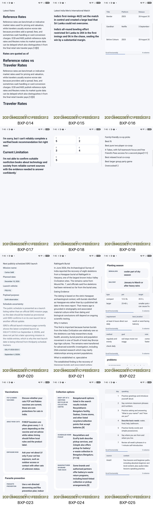
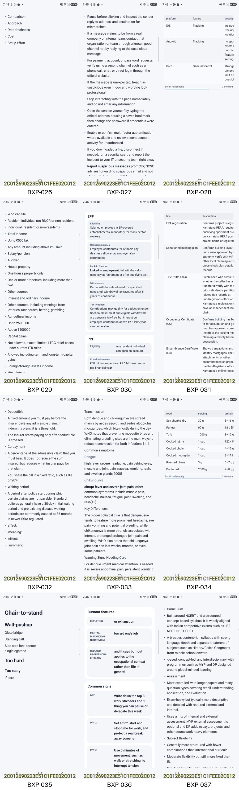
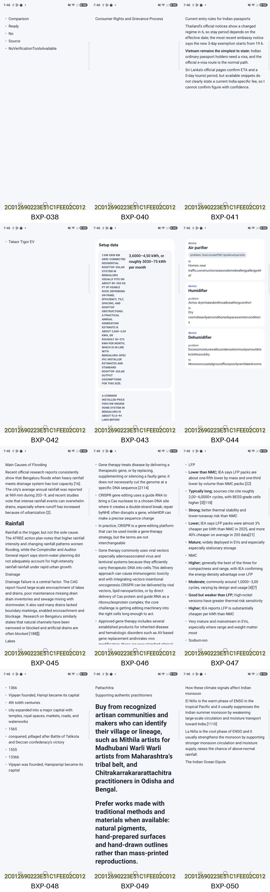
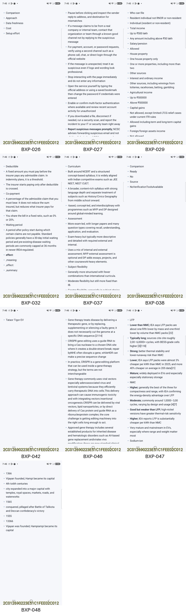

# Bixby50 generated-DSL repair-only report

This run tested aggressive, model-output-only A2UI Express recovery. It never rebuilt a document from the Perplexity/source text. The raw captured DSL was repaired, compiled to strict A2UI v0.9 JSON, and rendered only when a generated candidate existed.

The central result is **48/50 structurally renderable, 0/48 source-faithful**. The 48/50 number is a syntactic and renderer ceiling for partial generated output; it is not a correct-conversion score.

## Exact outcome

| Gate | Result | Evidence |
|---|---:|---|
| Raw strict Express compile | **0/50** | All captured model programs were initially invalid. |
| Existing bounded repair | **0/50** | Production-default BOM/fence/final-close repair remains unchanged. |
| Explicit generated-DSL repair | **48/50** | Broad repair enabled only with `allowGeneratedDslRepair=true`. |
| Strict A2UI JSON generated | **48/48** | Every accepted candidate compiled and round-tripped. |
| JVM native renderer | **48/48** | No JVM renderer error; one surface per case. |
| Physical device renderer | **48/48** | SM-F776U, Android 17 / API 37; no fatal renderer error. |
| Rejected before rendering | **2/50** | No complete generated value usable for a valid candidate. |
| Source-integrity accepted | **0/48** | Every structurally repaired candidate still lost, changed, added, duplicated, or reordered source content. |
| Source-text fallback | **0** | Disabled in both output-only and source-audit compiler calls. |
| Model calls during replay | **0** | Durable raw captures were reused. |

## What was repaired

The repair path is an explicit diagnostic mode. Ordinary `compileWithRepair` callers and the trained converter retain bounded behavior unless they opt in. The general pass is deterministic and bounded to 120,000 input characters, 2,048 lines, 64 balanced component calls, 64 literal items, 20,000 literal characters, 1,500 characters per literal, and the canonical graph limits.

The no-fallback result in this report applies to the explicit replay/test calls. The public API still defaults `allowSourceTextFallback=true`, and `GenUiTrainedConverter` does not enable broad generated-DSL salvage.

It can normalize exact wrappers and catalog spelling, normalize a narrow malformed table-column form, repair selected child/layout shapes, prune invalid graph edges, retain independently valid generated component calls under a new root, literalize syntactically valid generated state, and finally retain complete generated visible string values in a deterministic List. None of these candidates reads the source text.

| Recovery strategy | Count | Cases |
|---|---:|---|
| complete graph normalization | **1** | BXP-008 |
| component-call salvage | **21** | BXP-001, BXP-002, BXP-004, BXP-005, BXP-006, BXP-007, BXP-010, BXP-011, BXP-014, BXP-015, BXP-017, BXP-019, BXP-020, BXP-021, BXP-033, BXP-035, BXP-040, BXP-041, BXP-045, BXP-049, BXP-050 |
| generated-state literalization | **16** | BXP-003, BXP-012, BXP-013, BXP-016, BXP-018, BXP-022, BXP-023, BXP-024, BXP-025, BXP-028, BXP-030, BXP-031, BXP-034, BXP-036, BXP-043, BXP-044 |
| generated-literal salvage | **10** | BXP-026, BXP-027, BXP-029, BXP-032, BXP-037, BXP-038, BXP-042, BXP-046, BXP-047, BXP-048 |

Only **BXP-008** retained a complete generated graph. The other 47 accepted cases are partial reconstruction. The final 10-case literal tier is deliberately the most aggressive: it renders only complete string values found in model output after graph and state recovery failed, while filtering keys, style tokens, DSL fragments, duplicates, and over-budget strings.

## Rejected outputs

No candidate was produced for **BXP-009** or **BXP-039**. Neither output contained a useful complete component call, valid state assignment, or complete visible string value, so they were not sent to the renderer.

| First strict failure among rejected cases | Count |
|---|---:|
| incomplete/trailing envelope | 2 |

## Source-integrity findings after structural repair

The source audit ran with fallback disabled. Counts below are repaired cases containing each finding; one case can contain several findings. Candidate diagnostics are preserved verbatim for audit.

| Code | Finding | Cases |
|---|---|---:|
| `CIT-` | Missing citation markers | **46/48** |
| `NUM-` | Missing or changed numeric facts | **37/48** |
| `NUM+` | Added or duplicated numeric facts | **31/48** |
| `TXT-` | Missing source wording | **48/48** |
| `TXT+` | Added or duplicated visible wording | **45/48** |
| `ORDER` | Visible source wording order or multiplicity changed | **48/48** |

The two unrepaired cases have no generated document to audit and are recorded as not evaluated. Full messages are in each repaired case's `source_integrity_failure.txt` and in `repair_analysis.json`.

## Device rendering and visual review

The exact AAR-backed test app ran on `R3GL203AKSF` (SM-F776U) with a 1080x2520 viewport, density 480, and font scale 1.0. All 48 accepted documents produced screenshots and fresh accessibility hierarchies. There were **0 fatal renderer errors**.

The primary one-swipe run flagged table-observation issues in 7/48 rendered cases, so 41/48 passed every recorded harness check immediately. A supplemental seven-case table run used up to eight vertical and eight horizontal swipes. Four cases then exposed every expected header or representative cell. Three retained coverage issues:

- **BXP-008:** Unobserved table columns (d): [Neighborhood, Signature dish, Approx. cost per person, Opening hours, Opening hours]
- **BXP-018:** Unobserved table columns (a): [artist, date]
- **BXP-049:** Unobserved table columns (a): [geographical, motifsifs, technique, context]

These are viewport or recovered-content findings, not crashes. BXP-008 has no surviving table rows. BXP-018 and BXP-049 contain partial generated data whose listed columns were not all observed by the accessibility sweep.

The screenshots show the same practical limit: many results are sparse, some tables clip in the first viewport, some strings remain model-corrupted, and several headings are oversized because their original generated variants survived. The renderer is operating; structural recovery does not correct the generated facts or prose.

### Initial screenshots

### Most aggressive generated-literal tier

All ten literal-tier outputs drew successfully but are **0/10 usable as faithful answers**. Visual inspection found:

- **BXP-026:** Only five comparison headings survive; the three approaches, limitations, use cases, recommendation, and citations are absent.
- **BXP-027:** Only fragments of the verification checklist survive as a flat list; warning signs, example, office guidance, and citations are absent, and the initial capture did not reach the end.
- **BXP-029:** Material tax corruption: ₹50 lakh became ₹500 lakh and ₹5,000 became ₹500000; table associations, assessment year, examples, prose, and citations are lost.
- **BXP-032:** Material insurance corruption: 10% became 0%; visible parser debris remains (`effect:`, `,meaning:`, `,summary:`), and examples, exclusions, takeaway, and citations are missing.
- **BXP-037:** Visible text is duplicated, truncated, and fused; the CBSE/CISCE/IB comparison mapping, suitability section, caveat, and citations are lost.
- **BXP-038:** Internal fragments render as `Comparison / Ready / No / Source / NoVerificationToolsAvailable`, which loses the source apology and misleadingly exposes `Ready`.
- **BXP-042:** The full three-EV comparison collapses to one malformed bullet, `Tataor Tigor EV`; prices, ranges, warranties, recommendations, citations, and two vehicles are absent.
- **BXP-046:** Biomedical terms and citations are fused or corrupted (`byNHE`, `whileHDR`, `AV`, `[2114]`), raw field syntax remains, and key limitations are missing.
- **BXP-047:** Material battery-data corruption includes 30%→3%, 2025→205, 90–160→90–600, and malformed cycle ranges/citations; table associations are lost.
- **BXP-048:** Timeline facts and names are mangled (1336→1366/13366, 14th–16th→4th to6th, Vijayanagara→Vijayan, Hampi→Hampiampi), with most context and citations missing.

These remain useful only as a diagnostic ceiling showing that complete generated strings can be placed into valid A2UI. They should remain quarantined unless a source-integrity gate accepts them.

## Per-case result

Integrity codes are defined above. “Not rendered” means no generated candidate existed; no fallback document was substituted.

| Case | First strict failure | Recovery | Generated A2UI | JVM | Device | Integrity | Extended viewport issue | Artifacts |
|---|---|---|---:|---:|---|---|---|---|
| BXP-001 | unclosed expression | component-call salvage (2 call(s)) | yes | yes | rendered | `CIT-`, `NUM-`, `TXT-`, `TXT+`, `ORDER` | none | [result](BXP-001/replay_result.json) · [Express](BXP-001/recovered.output.express) · [A2UI JSON](BXP-001/recovered.output.a2ui.json) · [screen](BXP-001/initial.png) · [integrity](BXP-001/source_integrity_failure.txt) |
| BXP-002 | unknown property | component-call salvage (1 call(s)) | yes | yes | rendered | `CIT-`, `NUM-`, `NUM+`, `TXT-`, `TXT+`, `ORDER` | none | [result](BXP-002/replay_result.json) · [Express](BXP-002/recovered.output.express) · [A2UI JSON](BXP-002/recovered.output.a2ui.json) · [screen](BXP-002/initial.png) · [integrity](BXP-002/source_integrity_failure.txt) |
| BXP-003 | incomplete/trailing envelope | generated-state literalization (1 assignment(s), 1 field(s)) | yes | yes | rendered | `CIT-`, `NUM-`, `NUM+`, `TXT-`, `TXT+`, `ORDER` | none | [result](BXP-003/replay_result.json) · [Express](BXP-003/recovered.output.express) · [A2UI JSON](BXP-003/recovered.output.a2ui.json) · [screen](BXP-003/initial.png) · [integrity](BXP-003/source_integrity_failure.txt) |
| BXP-004 | incomplete/trailing envelope | component-call salvage (2 call(s)) | yes | yes | rendered | `CIT-`, `NUM-`, `NUM+`, `TXT-`, `TXT+`, `ORDER` | none | [result](BXP-004/replay_result.json) · [Express](BXP-004/recovered.output.express) · [A2UI JSON](BXP-004/recovered.output.a2ui.json) · [screen](BXP-004/initial.png) · [integrity](BXP-004/source_integrity_failure.txt) |
| BXP-005 | invalid gap enum | component-call salvage (18 call(s)) | yes | yes | rendered | `CIT-`, `NUM-`, `NUM+`, `TXT-`, `TXT+`, `ORDER` | none | [result](BXP-005/replay_result.json) · [Express](BXP-005/recovered.output.express) · [A2UI JSON](BXP-005/recovered.output.a2ui.json) · [screen](BXP-005/initial.png) · [integrity](BXP-005/source_integrity_failure.txt) |
| BXP-006 | incomplete/trailing envelope | component-call salvage (2 call(s)) | yes | yes | rendered | `CIT-`, `NUM-`, `NUM+`, `TXT-`, `TXT+`, `ORDER` | none | [result](BXP-006/replay_result.json) · [Express](BXP-006/recovered.output.express) · [A2UI JSON](BXP-006/recovered.output.a2ui.json) · [screen](BXP-006/initial.png) · [integrity](BXP-006/source_integrity_failure.txt) |
| BXP-007 | unclosed expression | component-call salvage (11 call(s)) | yes | yes | rendered | `CIT-`, `NUM-`, `NUM+`, `TXT-`, `TXT+`, `ORDER` | none | [result](BXP-007/replay_result.json) · [Express](BXP-007/recovered.output.express) · [A2UI JSON](BXP-007/recovered.output.a2ui.json) · [screen](BXP-007/initial.png) · [integrity](BXP-007/source_integrity_failure.txt) |
| BXP-008 | unknown property | complete graph normalization (1 graph) | yes | yes | rendered | `CIT-`, `NUM-`, `NUM+`, `TXT-`, `TXT+`, `ORDER` | Unobserved table columns (d): [Neighborhood, Signature dish, Approx. cost per person, Opening hours, Opening hours] | [result](BXP-008/replay_result.json) · [Express](BXP-008/recovered.output.express) · [A2UI JSON](BXP-008/recovered.output.a2ui.json) · [screen](BXP-008/initial.png) · [integrity](BXP-008/source_integrity_failure.txt) |
| BXP-009 | incomplete/trailing envelope | rejected | no | no | not rendered | not evaluated | none | [result](BXP-009/replay_result.json) |
| BXP-010 | children type | component-call salvage (9 call(s)) | yes | yes | rendered | `CIT-`, `NUM-`, `TXT-`, `TXT+`, `ORDER` | none | [result](BXP-010/replay_result.json) · [Express](BXP-010/recovered.output.express) · [A2UI JSON](BXP-010/recovered.output.a2ui.json) · [screen](BXP-010/initial.png) · [integrity](BXP-010/source_integrity_failure.txt) |
| BXP-011 | unclosed expression | component-call salvage (6 call(s)) | yes | yes | rendered | `CIT-`, `NUM-`, `NUM+`, `TXT-`, `TXT+`, `ORDER` | none | [result](BXP-011/replay_result.json) · [Express](BXP-011/recovered.output.express) · [A2UI JSON](BXP-011/recovered.output.a2ui.json) · [screen](BXP-011/initial.png) · [integrity](BXP-011/source_integrity_failure.txt) |
| BXP-012 | unbalanced delimiter | generated-state literalization (1 assignment(s), 1 field(s)) | yes | yes | rendered | `CIT-`, `TXT-`, `TXT+`, `ORDER` | none | [result](BXP-012/replay_result.json) · [Express](BXP-012/recovered.output.express) · [A2UI JSON](BXP-012/recovered.output.a2ui.json) · [screen](BXP-012/initial.png) · [integrity](BXP-012/source_integrity_failure.txt) |
| BXP-013 | incomplete/trailing envelope | generated-state literalization (1 assignment(s), 1 field(s)) | yes | yes | rendered | `CIT-`, `NUM-`, `TXT-`, `TXT+`, `ORDER` | none | [result](BXP-013/replay_result.json) · [Express](BXP-013/recovered.output.express) · [A2UI JSON](BXP-013/recovered.output.a2ui.json) · [screen](BXP-013/initial.png) · [integrity](BXP-013/source_integrity_failure.txt) |
| BXP-014 | unclosed expression | component-call salvage (7 call(s)) | yes | yes | rendered | `CIT-`, `NUM-`, `NUM+`, `TXT-`, `TXT+`, `ORDER` | none | [result](BXP-014/replay_result.json) · [Express](BXP-014/recovered.output.express) · [A2UI JSON](BXP-014/recovered.output.a2ui.json) · [screen](BXP-014/initial.png) · [integrity](BXP-014/source_integrity_failure.txt) |
| BXP-015 | unclosed expression | component-call salvage (3 call(s)) | yes | yes | rendered | `CIT-`, `NUM-`, `NUM+`, `TXT-`, `TXT+`, `ORDER` | none | [result](BXP-015/replay_result.json) · [Express](BXP-015/recovered.output.express) · [A2UI JSON](BXP-015/recovered.output.a2ui.json) · [screen](BXP-015/initial.png) · [integrity](BXP-015/source_integrity_failure.txt) |
| BXP-016 | incomplete/trailing envelope | generated-state literalization (1 assignment(s), 1 field(s)) | yes | yes | rendered | `CIT-`, `NUM-`, `NUM+`, `TXT-`, `TXT+`, `ORDER` | none | [result](BXP-016/replay_result.json) · [Express](BXP-016/recovered.output.express) · [A2UI JSON](BXP-016/recovered.output.a2ui.json) · [screen](BXP-016/initial.png) · [integrity](BXP-016/source_integrity_failure.txt) |
| BXP-017 | unclosed expression | component-call salvage (3 call(s)) | yes | yes | rendered | `NUM-`, `TXT-`, `ORDER` | none | [result](BXP-017/replay_result.json) · [Express](BXP-017/recovered.output.express) · [A2UI JSON](BXP-017/recovered.output.a2ui.json) · [screen](BXP-017/initial.png) · [integrity](BXP-017/source_integrity_failure.txt) |
| BXP-018 | incomplete/trailing envelope | generated-state literalization (1 assignment(s), 1 field(s)) | yes | yes | rendered | `CIT-`, `NUM-`, `NUM+`, `TXT-`, `TXT+`, `ORDER` | Unobserved table columns (a): [artist, date] | [result](BXP-018/replay_result.json) · [Express](BXP-018/recovered.output.express) · [A2UI JSON](BXP-018/recovered.output.a2ui.json) · [screen](BXP-018/initial.png) · [integrity](BXP-018/source_integrity_failure.txt) |
| BXP-019 | incomplete/trailing envelope | component-call salvage (7 call(s)) | yes | yes | rendered | `CIT-`, `NUM-`, `NUM+`, `TXT-`, `TXT+`, `ORDER` | none | [result](BXP-019/replay_result.json) · [Express](BXP-019/recovered.output.express) · [A2UI JSON](BXP-019/recovered.output.a2ui.json) · [screen](BXP-019/initial.png) · [integrity](BXP-019/source_integrity_failure.txt) |
| BXP-020 | unsupported prefix | component-call salvage (14 call(s)) | yes | yes | rendered | `CIT-`, `NUM-`, `NUM+`, `TXT-`, `TXT+`, `ORDER` | none | [result](BXP-020/replay_result.json) · [Express](BXP-020/recovered.output.express) · [A2UI JSON](BXP-020/recovered.output.a2ui.json) · [screen](BXP-020/initial.png) · [integrity](BXP-020/source_integrity_failure.txt) |
| BXP-021 | empty/invalid children | component-call salvage (11 call(s)) | yes | yes | rendered | `CIT-`, `NUM+`, `TXT-`, `TXT+`, `ORDER` | none | [result](BXP-021/replay_result.json) · [Express](BXP-021/recovered.output.express) · [A2UI JSON](BXP-021/recovered.output.a2ui.json) · [screen](BXP-021/initial.png) · [integrity](BXP-021/source_integrity_failure.txt) |
| BXP-022 | unbalanced delimiter | generated-state literalization (3 assignment(s), 5 field(s)) | yes | yes | rendered | `CIT-`, `NUM-`, `NUM+`, `TXT-`, `TXT+`, `ORDER` | none | [result](BXP-022/replay_result.json) · [Express](BXP-022/recovered.output.express) · [A2UI JSON](BXP-022/recovered.output.a2ui.json) · [screen](BXP-022/initial.png) · [integrity](BXP-022/source_integrity_failure.txt) |
| BXP-023 | incomplete/trailing envelope | generated-state literalization (1 assignment(s), 3 field(s)) | yes | yes | rendered | `CIT-`, `TXT-`, `TXT+`, `ORDER` | none | [result](BXP-023/replay_result.json) · [Express](BXP-023/recovered.output.express) · [A2UI JSON](BXP-023/recovered.output.a2ui.json) · [screen](BXP-023/initial.png) · [integrity](BXP-023/source_integrity_failure.txt) |
| BXP-024 | incomplete/trailing envelope | generated-state literalization (1 assignment(s), 1 field(s)) | yes | yes | rendered | `CIT-`, `TXT-`, `TXT+`, `ORDER` | none | [result](BXP-024/replay_result.json) · [Express](BXP-024/recovered.output.express) · [A2UI JSON](BXP-024/recovered.output.a2ui.json) · [screen](BXP-024/initial.png) · [integrity](BXP-024/source_integrity_failure.txt) |
| BXP-025 | unclosed expression | generated-state literalization (1 assignment(s), 2 field(s)) | yes | yes | rendered | `CIT-`, `NUM-`, `NUM+`, `TXT-`, `TXT+`, `ORDER` | none | [result](BXP-025/replay_result.json) · [Express](BXP-025/recovered.output.express) · [A2UI JSON](BXP-025/recovered.output.a2ui.json) · [screen](BXP-025/initial.png) · [integrity](BXP-025/source_integrity_failure.txt) |
| BXP-026 | unsupported prefix | generated-literal salvage (5 literal(s)) | yes | yes | rendered | `CIT-`, `TXT-`, `ORDER` | none | [result](BXP-026/replay_result.json) · [Express](BXP-026/recovered.output.express) · [A2UI JSON](BXP-026/recovered.output.a2ui.json) · [screen](BXP-026/initial.png) · [integrity](BXP-026/source_integrity_failure.txt) |
| BXP-027 | incomplete/trailing envelope | generated-literal salvage (9 literal(s)) | yes | yes | rendered | `CIT-`, `TXT-`, `ORDER` | none | [result](BXP-027/replay_result.json) · [Express](BXP-027/recovered.output.express) · [A2UI JSON](BXP-027/recovered.output.a2ui.json) · [screen](BXP-027/initial.png) · [integrity](BXP-027/source_integrity_failure.txt) |
| BXP-028 | incomplete/trailing envelope | generated-state literalization (1 assignment(s), 1 field(s)) | yes | yes | rendered | `CIT-`, `TXT-`, `TXT+`, `ORDER` | none | [result](BXP-028/replay_result.json) · [Express](BXP-028/recovered.output.express) · [A2UI JSON](BXP-028/recovered.output.a2ui.json) · [screen](BXP-028/initial.png) · [integrity](BXP-028/source_integrity_failure.txt) |
| BXP-029 | incomplete/trailing envelope | generated-literal salvage (28 literal(s)) | yes | yes | rendered | `CIT-`, `NUM-`, `NUM+`, `TXT-`, `TXT+`, `ORDER` | none | [result](BXP-029/replay_result.json) · [Express](BXP-029/recovered.output.express) · [A2UI JSON](BXP-029/recovered.output.a2ui.json) · [screen](BXP-029/initial.png) · [integrity](BXP-029/source_integrity_failure.txt) |
| BXP-030 | incomplete/trailing envelope | generated-state literalization (1 assignment(s), 2 field(s)) | yes | yes | rendered | `CIT-`, `NUM-`, `NUM+`, `TXT-`, `TXT+`, `ORDER` | none | [result](BXP-030/replay_result.json) · [Express](BXP-030/recovered.output.express) · [A2UI JSON](BXP-030/recovered.output.a2ui.json) · [screen](BXP-030/initial.png) · [integrity](BXP-030/source_integrity_failure.txt) |
| BXP-031 | incomplete/trailing envelope | generated-state literalization (1 assignment(s), 1 field(s)) | yes | yes | rendered | `CIT-`, `TXT-`, `TXT+`, `ORDER` | none | [result](BXP-031/replay_result.json) · [Express](BXP-031/recovered.output.express) · [A2UI JSON](BXP-031/recovered.output.a2ui.json) · [screen](BXP-031/initial.png) · [integrity](BXP-031/source_integrity_failure.txt) |
| BXP-032 | incomplete/trailing envelope | generated-literal salvage (12 literal(s)) | yes | yes | rendered | `CIT-`, `NUM-`, `NUM+`, `TXT-`, `TXT+`, `ORDER` | none | [result](BXP-032/replay_result.json) · [Express](BXP-032/recovered.output.express) · [A2UI JSON](BXP-032/recovered.output.a2ui.json) · [screen](BXP-032/initial.png) · [integrity](BXP-032/source_integrity_failure.txt) |
| BXP-033 | incomplete/trailing envelope | component-call salvage (13 call(s)) | yes | yes | rendered | `CIT-`, `NUM-`, `NUM+`, `TXT-`, `TXT+`, `ORDER` | none | [result](BXP-033/replay_result.json) · [Express](BXP-033/recovered.output.express) · [A2UI JSON](BXP-033/recovered.output.a2ui.json) · [screen](BXP-033/initial.png) · [integrity](BXP-033/source_integrity_failure.txt) |
| BXP-034 | incomplete/trailing envelope | generated-state literalization (1 assignment(s), 1 field(s)) | yes | yes | rendered | `CIT-`, `NUM-`, `NUM+`, `TXT-`, `TXT+`, `ORDER` | none | [result](BXP-034/replay_result.json) · [Express](BXP-034/recovered.output.express) · [A2UI JSON](BXP-034/recovered.output.a2ui.json) · [screen](BXP-034/initial.png) · [integrity](BXP-034/source_integrity_failure.txt) |
| BXP-035 | incomplete/trailing envelope | component-call salvage (8 call(s)) | yes | yes | rendered | `CIT-`, `NUM-`, `NUM+`, `TXT-`, `TXT+`, `ORDER` | none | [result](BXP-035/replay_result.json) · [Express](BXP-035/recovered.output.express) · [A2UI JSON](BXP-035/recovered.output.a2ui.json) · [screen](BXP-035/initial.png) · [integrity](BXP-035/source_integrity_failure.txt) |
| BXP-036 | incomplete/trailing envelope | generated-state literalization (1 assignment(s), 4 field(s)) | yes | yes | rendered | `CIT-`, `NUM-`, `NUM+`, `TXT-`, `TXT+`, `ORDER` | none | [result](BXP-036/replay_result.json) · [Express](BXP-036/recovered.output.express) · [A2UI JSON](BXP-036/recovered.output.a2ui.json) · [screen](BXP-036/initial.png) · [integrity](BXP-036/source_integrity_failure.txt) |
| BXP-037 | incomplete/trailing envelope | generated-literal salvage (25 literal(s)) | yes | yes | rendered | `CIT-`, `NUM-`, `NUM+`, `TXT-`, `TXT+`, `ORDER` | none | [result](BXP-037/replay_result.json) · [Express](BXP-037/recovered.output.express) · [A2UI JSON](BXP-037/recovered.output.a2ui.json) · [screen](BXP-037/initial.png) · [integrity](BXP-037/source_integrity_failure.txt) |
| BXP-038 | unbalanced delimiter | generated-literal salvage (5 literal(s)) | yes | yes | rendered | `TXT-`, `TXT+`, `ORDER` | none | [result](BXP-038/replay_result.json) · [Express](BXP-038/recovered.output.express) · [A2UI JSON](BXP-038/recovered.output.a2ui.json) · [screen](BXP-038/initial.png) · [integrity](BXP-038/source_integrity_failure.txt) |
| BXP-039 | incomplete/trailing envelope | rejected | no | no | not rendered | not evaluated | none | [result](BXP-039/replay_result.json) |
| BXP-040 | incomplete/trailing envelope | component-call salvage (1 call(s)) | yes | yes | rendered | `CIT-`, `NUM-`, `NUM+`, `TXT-`, `TXT+`, `ORDER` | none | [result](BXP-040/replay_result.json) · [Express](BXP-040/recovered.output.express) · [A2UI JSON](BXP-040/recovered.output.a2ui.json) · [screen](BXP-040/initial.png) · [integrity](BXP-040/source_integrity_failure.txt) |
| BXP-041 | unclosed expression | component-call salvage (4 call(s)) | yes | yes | rendered | `CIT-`, `NUM-`, `NUM+`, `TXT-`, `TXT+`, `ORDER` | none | [result](BXP-041/replay_result.json) · [Express](BXP-041/recovered.output.express) · [A2UI JSON](BXP-041/recovered.output.a2ui.json) · [screen](BXP-041/initial.png) · [integrity](BXP-041/source_integrity_failure.txt) |
| BXP-042 | incomplete/trailing envelope | generated-literal salvage (1 literal(s)) | yes | yes | rendered | `CIT-`, `NUM-`, `TXT-`, `TXT+`, `ORDER` | none | [result](BXP-042/replay_result.json) · [Express](BXP-042/recovered.output.express) · [A2UI JSON](BXP-042/recovered.output.a2ui.json) · [screen](BXP-042/initial.png) · [integrity](BXP-042/source_integrity_failure.txt) |
| BXP-043 | incomplete/trailing envelope | generated-state literalization (1 assignment(s), 1 field(s)) | yes | yes | rendered | `CIT-`, `NUM-`, `NUM+`, `TXT-`, `TXT+`, `ORDER` | none | [result](BXP-043/replay_result.json) · [Express](BXP-043/recovered.output.express) · [A2UI JSON](BXP-043/recovered.output.a2ui.json) · [screen](BXP-043/initial.png) · [integrity](BXP-043/source_integrity_failure.txt) |
| BXP-044 | incomplete/trailing envelope | generated-state literalization (1 assignment(s), 1 field(s)) | yes | yes | rendered | `CIT-`, `NUM-`, `TXT-`, `TXT+`, `ORDER` | none | [result](BXP-044/replay_result.json) · [Express](BXP-044/recovered.output.express) · [A2UI JSON](BXP-044/recovered.output.a2ui.json) · [screen](BXP-044/initial.png) · [integrity](BXP-044/source_integrity_failure.txt) |
| BXP-045 | incomplete/trailing envelope | component-call salvage (14 call(s)) | yes | yes | rendered | `CIT-`, `NUM-`, `NUM+`, `TXT-`, `TXT+`, `ORDER` | none | [result](BXP-045/replay_result.json) · [Express](BXP-045/recovered.output.express) · [A2UI JSON](BXP-045/recovered.output.a2ui.json) · [screen](BXP-045/initial.png) · [integrity](BXP-045/source_integrity_failure.txt) |
| BXP-046 | incomplete/trailing envelope | generated-literal salvage (6 literal(s)) | yes | yes | rendered | `CIT-`, `TXT-`, `TXT+`, `ORDER` | none | [result](BXP-046/replay_result.json) · [Express](BXP-046/recovered.output.express) · [A2UI JSON](BXP-046/recovered.output.a2ui.json) · [screen](BXP-046/initial.png) · [integrity](BXP-046/source_integrity_failure.txt) |
| BXP-047 | unclosed expression | generated-literal salvage (21 literal(s)) | yes | yes | rendered | `CIT-`, `NUM-`, `NUM+`, `TXT-`, `TXT+`, `ORDER` | none | [result](BXP-047/replay_result.json) · [Express](BXP-047/recovered.output.express) · [A2UI JSON](BXP-047/recovered.output.a2ui.json) · [screen](BXP-047/initial.png) · [integrity](BXP-047/source_integrity_failure.txt) |
| BXP-048 | incomplete/trailing envelope | generated-literal salvage (9 literal(s)) | yes | yes | rendered | `CIT-`, `NUM-`, `NUM+`, `TXT-`, `TXT+`, `ORDER` | none | [result](BXP-048/replay_result.json) · [Express](BXP-048/recovered.output.express) · [A2UI JSON](BXP-048/recovered.output.a2ui.json) · [screen](BXP-048/initial.png) · [integrity](BXP-048/source_integrity_failure.txt) |
| BXP-049 | unbalanced delimiter | component-call salvage (8 call(s)) | yes | yes | rendered | `CIT-`, `TXT-`, `TXT+`, `ORDER` | Unobserved table columns (a): [geographical, motifsifs, technique, context] | [result](BXP-049/replay_result.json) · [Express](BXP-049/recovered.output.express) · [A2UI JSON](BXP-049/recovered.output.a2ui.json) · [screen](BXP-049/initial.png) · [integrity](BXP-049/source_integrity_failure.txt) |
| BXP-050 | incomplete/trailing envelope | component-call salvage (4 call(s)) | yes | yes | rendered | `CIT-`, `NUM-`, `TXT-`, `TXT+`, `ORDER` | none | [result](BXP-050/replay_result.json) · [Express](BXP-050/recovered.output.express) · [A2UI JSON](BXP-050/recovered.output.a2ui.json) · [screen](BXP-050/initial.png) · [integrity](BXP-050/source_integrity_failure.txt) |

## Reproducibility and artifact checks

- Captured raw Express SHA-256 matched the host source run for **50/50** cases.
- Each accepted case stores the raw model output, repaired Express, strict A2UI JSON, device result, source-integrity details, initial screenshot, and initial hierarchy.
- `repair_analysis.json` contains the machine-readable aggregate and all case diagnostics; `per_case.csv` is the compact matrix.
- `table_coverage/` contains the seven-case extended sweep.
- `checksums.sha256` covers every retained validation artifact except the checksum file itself.

## Decision

General repair raises syntactic and renderer coverage from 0/50 to 48/50 without source fallback. It does not make the E2B output correct: all 48 repaired documents fail mechanical source integrity. Keep this broad mode explicit and diagnostic; a production conversion should require integrity acceptance or a better model output rather than treating structural rendering as success.
