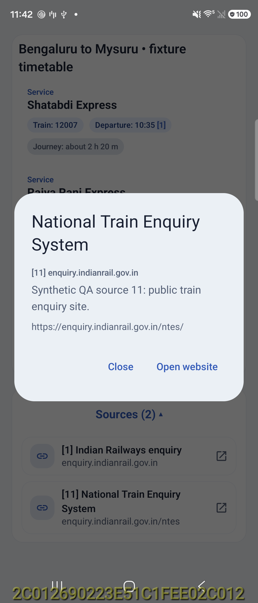
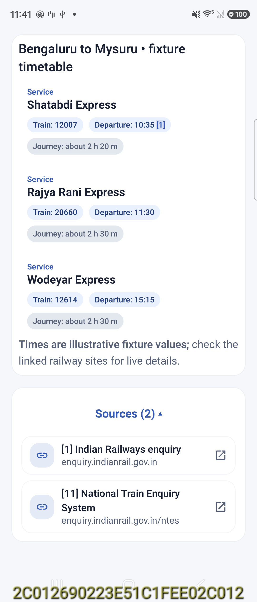
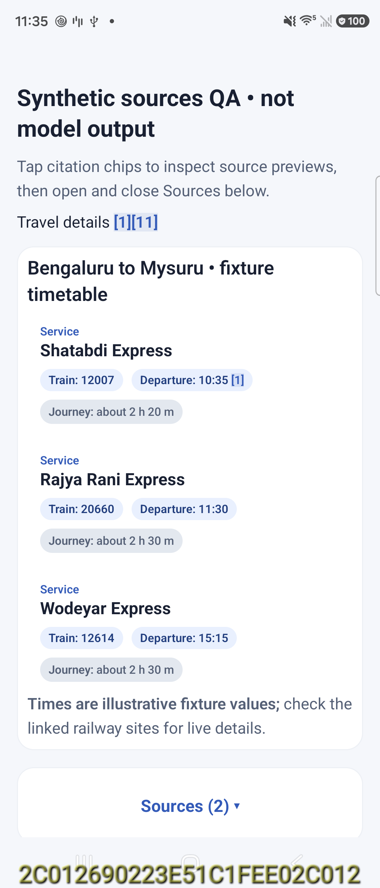

# SDK 0.5.2 citation interaction validation

Date: 2026-09-28. Device: connected SM-F776U, Android 17.

## Behavior

The shared renderer now previews exact host-supplied citation IDs in body text, tables and cards. Adjacent `[1][11]` and grouped `[1, 11]` references are supported. Unknown IDs and existing hyperlinks are left unchanged. Source details include title, domain, exact reference number, optional host description and URL. Only **Open website** sends an external URL action; Back, Close and outside dismissal simply dismiss the preview.

The Sources section starts collapsed and toggles its rows. `GenUiView.showSources = false` or the equivalent `GenUiContent` overload suppresses this section while retaining inline previews. Bixby uses that option because its existing answer footer already owns the Sources button/list. Source metadata is serialized with the compiled answer, and descriptions are not passed into the formatting model. Older SDK documents can recover exact IDs/titles/URLs from their source buttons; absent descriptions are not invented.

## Validation

| Check | Result |
|---|---|
| SDK converter, attribution and citation annotation tests | 18 passed |
| Isolated host regression and synthetic fixture tests | 9 passed |
| SDK release AAR publication | Passed |
| A2UI test app build/install with published AAR | Passed |
| Tap inline citation 11 | Correct source 11 title, description and URL |
| Tap citation 1 in a train-card field | Correct source 1 preview |
| Tap expanded source 11 row | Same source 11 preview |
| Sources expand and collapse | Rows revealed, then hidden |
| Hide SDK Sources list | No duplicate section; citation 11 still previews |
| Preview versus navigation | No URL callback on preview; explicit Open website logged the exact source 1 URL |
| Dismiss after scrolling | Source-control bounds identical before/after: `[400,1697][681,1762]` |

All native rendering screenshots use the explicitly synthetic `sources_qa.express` fixture, not model generation. No inference benchmark or model changes were performed. A small scroll-restoration fix is scoped to source previews in `GenUiView`, guarded against changed/detached documents, and retains normal focus handling.

## Bixby delivery boundary

The current installed Bixby was inspected: its Sources footer toggles and its inline reference opens a details popup. The local Bixby checkout now forwards source descriptions, consumes SDK 0.5.2, and keeps its existing footer. Its earlier inline-answer placement and per-answer Bixby/GenUICraft selector changes are included in the cumulative patch.

The patch ZIP contains 40 files: 20 source/documentation files and 20 files in the complete versioned local Maven publication. Every entry was SHA-256 checked against the updated Bixby checkout; archive integrity and exclusion checks passed. No Bixby files were pushed to the A2UI repository.

**The modified Bixby APK was not built or installed:** private Bixby dependencies are unavailable here. Device interaction evidence above is from the isolated SDK renderer app, not a claim of post-install Bixby integration validation. Rebuild Bixby with the changed files, then check two answers, each renderer selector, Sources, citation preview/dismissal, scrolling and history restoration.

Publication SHA-256: `c6e66f6a1e45f3a679a439443aad283b2dd7812a5e0e91d6951a35d870b21841`.

Local cumulative ZIP: `GenUICraft/artifacts/Bixby-GenUICraft-Inline-Sources-20260928.zip`.

ZIP SHA-256: `63e63577a22d580b8e7f48e4b0b72b9da2afa547a3359c4da69f1081cb554bbc`.
