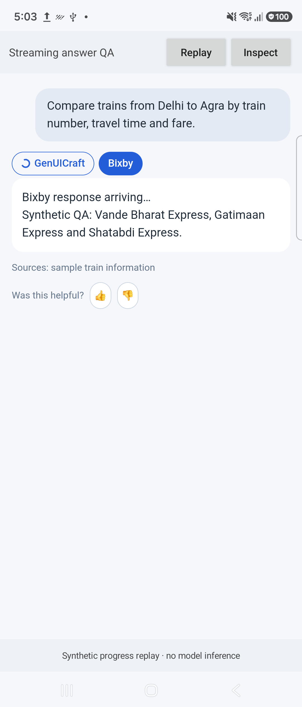
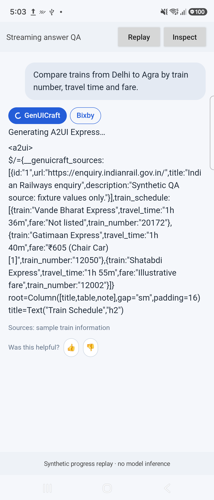
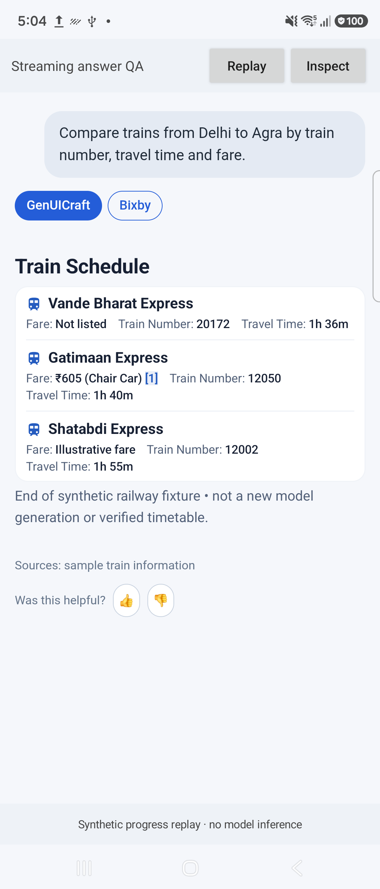

# Bixby streaming GenUICraft controls

Date: 2026-09-29. SDK remains **0.5.5**; this update changes the Bixby integration.

## Behavior

The GenUICraft and Bixby buttons now appear with the first nonempty streamed Bixby answer, instead of waiting for conversion to finish. Bixby is initially visible. A circular indicator runs inside the GenUICraft button while the answer is being collected, the model is generating Express, and the SDK is preparing the rendered view.

Selecting GenUICraft while work is pending shows a status followed by live raw A2UI Express. The content wraps in the parent transcript with no independent vertical scroll area. Once SDK conversion/recovery succeeds and the native card reports its measured size, the same answer position switches to rendered UI. The raw view is retained during the measurement handshake so original Markdown does not flash between these states.

An explicit choice of Bixby remains Bixby after completion. An explicit choice of GenUICraft remains GenUICraft. If neither button is touched, completed answers retain the previous automatic GenUICraft display behavior. Errors stop the spinner, display a status and keep the Bixby answer available. Pending raw text is not written to completed-answer history.

## Shared pipeline and lifecycle

Bixby now attaches the existing SDK `GenUiGenerationObserver` to `GenUiSession.convert`. Model inference, trained prompting, recovery and compilation remain in the SDK. The model file, GPU precision, MTP preference and prompt are unchanged. Partial text is bounded and coalesced at a 90 ms interval; the final attempt always publishes without throttling before recovery. Request/generation-token guards discard stale callbacks after cancellation or replacement. Duplicate source/final loading events cannot overwrite a live Express stream.

Pending selection is tracked by exact conversation/request key. Completion preserves that explicit mode, including when older history finishes loading from disk later. Controls remain 32 CSS px high, and completed cards retain SDK 0.5.5's compact padding and parent-owned scroll behavior. Express is inserted as literal `textContent`, not HTML.

## Validation

**34 targeted checks passed:** 14 host/store/registry Android JVM checks, 5 manager integration checks, 12 JavaScript adapter checks and 3 production-observer callback checks. The manager and registry compile against SDK 0.5.5; private Bixby DTOs are stubbed in the manager harness. The callback tests extract and execute the production callback block. Both QA app builds/installs succeeded.

On the connected **Fold7 SM-F966B (Android 16, cover display)**, the QA host used the actual changed Bixby host, registry and JavaScript with SDK 0.5.5 and the newer Compose runtime. A deterministic synthetic railway fixture exercised these states:

| Check | Observed |
| --- | --- |
| Initial waiting | Both selectors visible, Bixby selected, GenUICraft `aria-busy=true` |
| Tap GenUICraft | Raw Express visible; original answer hidden only for this answer |
| Further generation / recovery | Raw content grows; circular indicator remains active |
| Completion | Spinner stops, raw area collapses and measured native cards become visible |
| Native sizing | 997 × 912 physical px; zero NestedScrollView descendants |
| Explicit Bixby selection | Remains selected after successful conversion |
| Failure | Spinner stops; status and original Bixby answer remain available |
| Raw scrolling | Parent scrollY reached 141.333 CSS px after a swipe within the raw stream |

No fatal/linkage markers for the initial QA process were found in its captured diagnostics window. This is limited runtime evidence, not a general stability guarantee.

The fixture replays generated-text events; **no new model inference or model-quality benchmark was performed**. The full proprietary Bixby APK was not rebuilt here. Merge the ZIP, rebuild/install Bixby and verify its complete request lifecycle on that APK.

## Earliest safe answer binding

The exact JavaScript served to the installed Bixby WebView was inspected without modification: `uiBundle.bd3573190cda6fbea93a.js`, SHA-256 `a9ee0f416c409f9df87facd20f02dcc09e7dff6f4be8557e6db3bb76aa3caa88`. Its reducer marks `Stream`/`StreamDelta` answers as ordinary, non-progress dialog groups. Their mobile footer includes the existing exact `feedback-button-up-<requestId>` anchor when the first renderable text arrives. Consequently the adapter can bind before the full response or GenUICraft conversion finishes.

The empty loading placeholder and `Progress`-only dialogs do not expose a safe request ID in the DOM. Controls therefore start at the first nonempty streamed answer, not the earlier empty placeholder. No latest-bubble heuristic is used. This timing conclusion is source-derived: a live first-chunk capture was interrupted by a screen-sharing prompt, which was canceled. The QA device run verifies the control behavior once that exact answer anchor exists.

## Preview

Waiting with Bixby visible:

GenUICraft selected during generation:

Completed answer at the same position:

## Delivery

`GenUICraft/artifacts/Bixby-GenUICraft-Streaming-Controls-20260929.zip`

SHA-256: `2b9439aa4bab481e11260c61a90c76a16fbb4bfe1988382395f1d032631879cc`.

The ZIP preserves the Bixby directory structure and includes the previous layout/SDK 0.5.5 merge files. It contains 40 files; six files changed in this iteration: the manager, registry, host, answer-slot JavaScript, inline strings and integration documentation. Every ZIP entry matches the updated `Bixby_18Sep` checkout. The AAR is unchanged. Proprietary Bixby source and the served web bundle are excluded from the public Git commit.

Evidence: [tests](test-summary.json), [device measurements](device-measurements.json), [archive hashes](delivery-verification.json).
