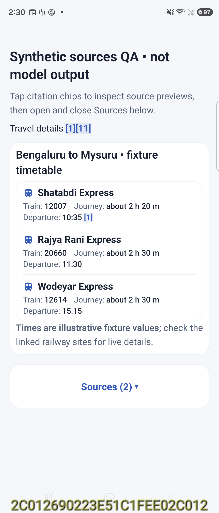
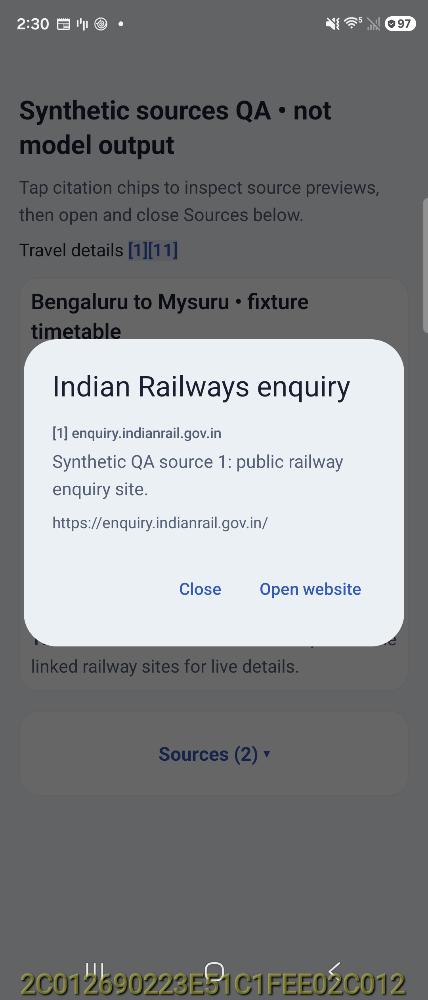
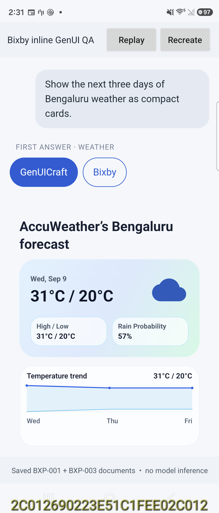
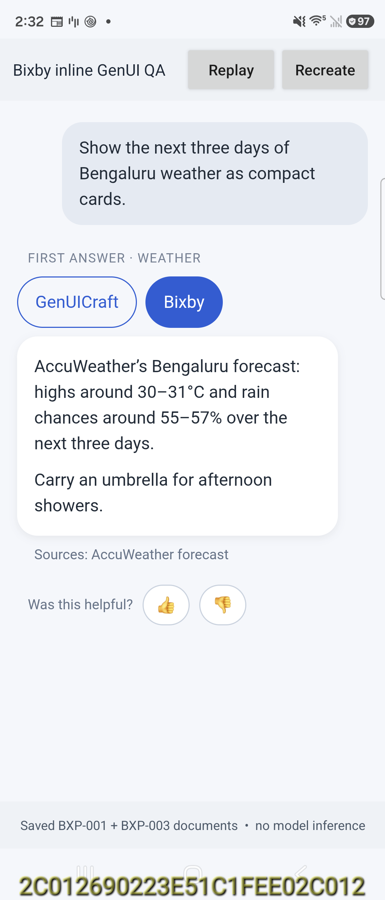

# SDK 0.5.4: Compose host compatibility

The renderer crash is fixed in the shared SDK and verified on SM_F776U in a QA app using the installed Bixby APK's exact Compose versions. The updated Android demo is also installed. A rebuilt Bixby APK is still required to validate the complete proprietary app.

## Root cause

The installed Bixby 5.0.10.38 contains Foundation / Foundation Layout **1.11.4** and Material3 **1.5.0-alpha17**. SDK 0.5.3 was compiled with Foundation **1.7.5**. Its experimental `FlowRow` calls referenced an older signature with `FlowRowOverflow`, absent from Bixby's runtime.

The fresh Bixby railway request logged GPU FP32 with MTP enabled, then successful conversion (one attempt, repair `NONE`, 11 warnings), followed by `NoSuchMethodError` in `NativeTrainUiRenderer.TrainRow`. Thus the observed crash occurred after conversion. See [focused Bixby log](bixby-before-fix.txt). This does not establish model output accuracy or inference speed.

The old 0.5.3 AAR also reproduced the same crash in the exact-version QA host: [negative control log](baseline-crash.txt). Its bytecode scan found old flow-layout API references in 13 of 536 classes.

## Fix

- All 34 renderer FlowRow call sites use an SDK-owned wrapping `Layout`, preserving spacing, RTL positioning and row-local metric weights. The Android reference renderer uses the same implementation.
- The 0.5.4 AAR has **zero forbidden flow-layout references across 543 classes**, including generated composable classes. [Artifact scan](new-aar-abi.json).
- Bixby's Renderer dependency and local Maven publication are updated to 0.5.4. Its host catches synchronous `LinkageError` during card construction, rendering and attachment, removes the failed card and restores the original answer. Later asynchronous Compose errors are outside this guard; the SDK fix is essential.
- Model, prompt, recovery and inference configuration are unchanged.

## Validation

| Check | Result |
| --- | --- |
| SDK debug/release compilation and local publication | Pass |
| Targeted wrapping, RTL, weights, railway semantics, tables and citations | 27 tests passed |
| Isolated synchronous host-failure handling | 7 tests passed; unrelated VM errors propagate |
| Old AAR + Bixby Compose runtime | Reproduces the same FlowRow crash |
| Fixed AAR + same runtime | Railway, weather and historical Express replay render |
| Railway citation | Correct source 1 popup opens and closes |
| Sources list | Expands to sources 1 and 11 |
| Inline answer host | Switch to original Bixby text and back; saved answer survives Recreate |
| Fixed QA processes | No AndroidRuntime error lines for the three tested PIDs |
| Android demo on Foundation 1.7.5 | Build/install pass; saved BXP-001 and BXP-003 reference renders pass, 2/2 |

The fixed tests replay saved documents and a clearly labeled synthetic citation fixture; they do not run new model inference. The historical Express fixture was kept unchanged, including its old malformed values and recovered-text card. It establishes rendering compatibility, not answer quality. These smoke checks do not exhaust all components, themes, locales or device configurations.

Evidence: [test summary](test-summary.json), [device verification](device-verification.json), [runtime versions](bixby-compose-versions.json), [reference captures](reference-capture.jsonl).

| Compact railway fixture | Source popup |
| --- | --- |
|  |  |

| Generated answer in the QA conversation | Original answer selected |
| --- | --- |
|  |  |

## Delivery

`Bixby-GenUICraft-Compose-Compatibility-20260929.zip` is a cumulative merge patch with the existing directory structure. All **40 files** were byte-verified against the updated `C:\Users\anupk\Downloads\Bixby_18Sep` checkout. It retains the previous nullable conversation-ID fix, answer-position/source changes and compact railway rendering, and replaces the packaged SDK publication with 0.5.4.

- AAR SHA-256: `df0a67d276b63c15fbea76fdf614b1650d20d9963b0cc725d7e6c1161610698b`
- ZIP SHA-256: `c40aa81646013213066bab61896a9f3a875008ee21c30e3faeb1d4d222288eeb`
- [Delivery verification](delivery-verification.json)

Merge the ZIP into the Bixby source root, preserving directories, then rebuild and install Bixby with its private dependencies. The current installed Bixby APK has not been replaced by this fix. The standalone QA checks are evidence for the Compose mismatch and its repair, not a claim of completed rebuilt-Bixby validation.
