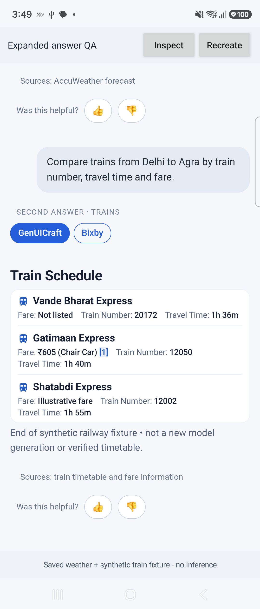

# Expanded Bixby answers and compact railway cards

Date: 2026-09-29. SDK: **0.5.5**.

## Delivered changes

- GenUICraft/Bixby selectors are **32 CSS px high**, with smaller label spacing and explicit height overrides.
- Embedded GenUICraft adds **0 dp horizontal outer padding**, 4 dp vertical padding and a transparent background. Bixby's own transcript margin remains. Compact train rows retain 12 dp inner horizontal padding for readable content.
- Railway tables containing train identity plus travel time now use the compact grouped train renderer, including when station/departure columns are absent. Train name, number, fare, duration, additional fields and citation markers are preserved. Generic/fare-only/conflicting-domain tables retain their existing route, and explicit table presentation is respected.
- Embedded GenUiView has no NestedScrollView. It reports natural content height to the Bixby host, which reserves that height for the specific answer and forwards vertical drags to the conversation WebView. Original content remains available until that answer's native view is measured. Taps, citation dialogs, horizontal controls and per-answer mode selection remain supported.

## Device evidence

Tested on the connected **Fold7 SM-F966B**, Android 16, cover display. The QA app uses the actual changed Bixby host/geometry/JavaScript sources and published SDK with the newer Compose runtime used for compatibility validation. The main demo was also rebuilt and installed with SDK 0.5.5.

| Check | Observed result |
| --- | --- |
| Selector height | All four selectors across two answers measured 32 CSS px |
| Full-height answer | Saved weather answer measured 2,473 physical px; its reserved HTML height matched at device scale |
| Parent-only scrolling | A vertical drag inside that answer changed parent scrollY from 0 to 494.857 CSS px; native height stayed 2,473 px |
| Nested vertical scrolling | Zero NestedScrollView descendants in both embedded answer views |
| Compact railway layout | All three services appear in one compact group; answer height 912 physical px; footer follows the full content |
| Citation | Citation 1 opened the Indian Railways details; closing it preserved parent scrollY exactly |
| View switching | Bixby/GenUICraft switching worked; selected mode persisted across QA relaunch |
| Runtime diagnostics | No fatal/linkage markers for the QA process IDs in the captured log window |

The train input is a **synthetic renderer fixture**, not a newly generated model answer or a verified timetable. The first answer reuses a saved BXP-001 weather result. No inference, prompt or model settings were changed for this fix. Initial scroll/citation snapshots used the same host implementation before a QA-only query-label/spacer correction; the final screenshot reflects the corrected fixture labels.

## Validation

**45 targeted checks passed:** 32 SDK JVM/Robolectric checks, 8 JavaScript answer-slot checks and 5 source-extracted host JVM checks. SDK publication, reference app build/install and QA host build/install all passed. The AAR ABI scan inspected 544 classes and found no legacy Compose Foundation FlowRow/FlowRowOverflow references.

The host regression checks cover tall slot geometry, per-answer size isolation, width changes, stale document/conversation callbacks, recreation with cached size, coalesced updates and readiness. They use small platform stand-ins; device evidence supplies the Compose measurement and touch-routing checks. The full proprietary Bixby build/test suite was not run.

## Merge delivery

Archive: `GenUICraft/artifacts/Bixby-GenUICraft-Expanded-Layout-20260929.zip`.

SHA-256: `b38ce39a7aca7270a79ab8cb96eb47948dd1ded4768b56f9d01998009d832455`.

SDK AAR SHA-256: `cbd86d49ec7f41ee1152e50e1ddaabfd30d2427f50072f235c4d4f40bcf0b918`.

The cumulative merge archive contains 40 files: 20 Bixby source/test/documentation files and the 20-file SDK 0.5.5 Maven publication. Five host source files changed in this iteration: `Renderer/build.gradle.kts`, `GenUiHostView.kt`, `GenUiInlineGeometry.kt`, `answer_slots.js` and the integration document. Previous nullable-ID, source, history and Compose-compatibility fixes remain included. The ZIP has no extra enclosing directory. Every entry was hash-verified against the named Bixby checkout after applying the update.

Extract into the Bixby checkout, preserving paths, then rebuild/install Bixby. **The installed proprietary Bixby APK has not been rebuilt by this task**, so its final conversation behavior still requires validation after that APK is supplied. No proprietary Bixby sources are committed or pushed in the A2UI repository.

Machine-readable evidence: [measurements](layout-measurements.json), [device checks](device-verification.json), [tests](test-summary.json), [delivery hashes](delivery-verification.json), [ABI scan](aar-abi.json).
