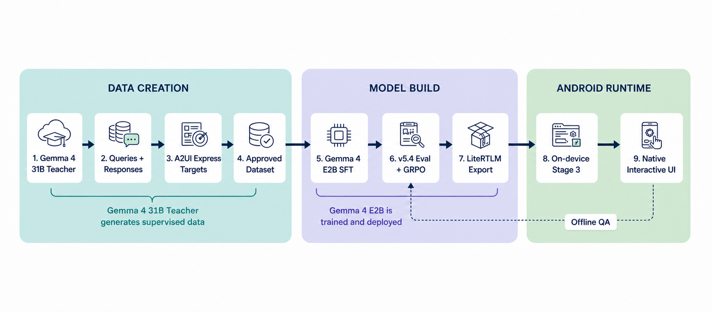
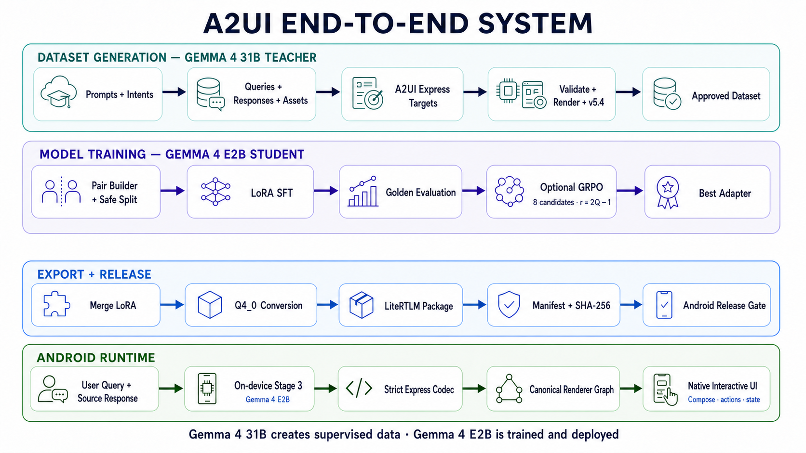
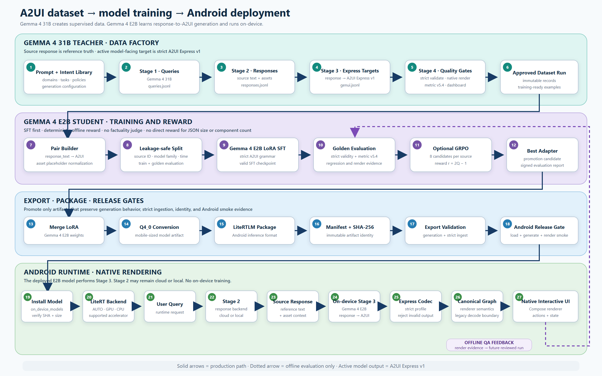
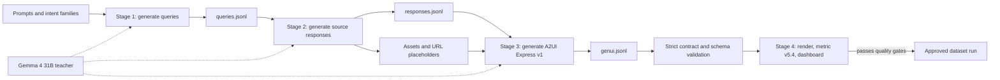

# A2UI end-to-end system architecture

This document explains how A2UI data is generated, how the smaller model is trained, and how that model is deployed into the Android runtime.

The most important distinction is:

- **Gemma 4 31B is the teacher.** It generates the supervised dataset: queries, source responses, assets, and A2UI Express targets.
- **Gemma 4 E2B is the student.** It learns the response-to-A2UI transformation and is the model exported for on-device inference.

### Overall system infographic

This presentation view summarizes the four production lanes and keeps the teacher, student, export, and Android runtime responsibilities visually separate.

## Detailed architecture

The detailed vector view adds the concrete dataset artifacts, training gates, export identity, backend selection, strict ingestion boundary, and native Android runtime components. It is rendered as SVG so every technical label remains exact and readable.

An editable, resolution-independent version is available as `assets/a2ui_system_architecture/02_a2ui_detailed_architecture.svg`.

## One-sentence view

Gemma 4 31B creates and validates examples, Gemma 4 E2B learns from the approved examples, and Android runs the exported E2B model to turn a response into an interactive native UI.

## 1. Dataset generation

### What each stage does

1. **Stage 1 creates realistic user queries.** The prompt and intent mix control which domains and UI needs are represented.
2. **Stage 2 creates the source response.** This is the reference content that the UI must preserve. Media is represented through controlled assets and placeholders.
3. **Stage 3 creates the target UI representation.** Gemma 4 31B converts the response into strict A2UI Express v1 IR using `genui_gen_mobile_a2ui_express_v1.md`.
4. **Stage 4 validates and measures the result.** The pipeline checks the contract, renders where evidence is available, computes GenUI Representation Quality v5.4, and produces review/dashboard artifacts.
5. **Only approved records become training data.** Failed, malformed, or low-quality targets should be repaired by fixing the prompt, pipeline, or renderer and regenerating them—not by manually rewriting sample JSON.

Key implementation entry points:

- `dataset/src/main.py`
- `dataset/prompts/genui_gen_mobile_a2ui_express_v1.md`
- `dataset/schema/genui_flatspec.schema.json`
- `dataset/src/pipeline/stage3_genui.py`
- `dataset/src/pipeline/stage4_render.py`

## 2. Model training and reward flow

```mermaid
flowchart LR
    D["Approved dataset runs"] --> B["Build response_text → A2UI pairs"]
    B --> N["Normalize assets and placeholders"]
    N --> SP["Split by source, model family, and time"]
    SP --> TR["Training split"]
    SP --> EV["Golden evaluation split"]

    TR --> SFT["Gemma 4 E2B LoRA SFT"]
    SFT --> CK["Valid SFT checkpoint"]
    CK --> EVAL["Strict validity + v5.4 evaluation"]
    EV --> EVAL
    EVAL -->|"optional after sign-off"| GRPO["GRPO: 8 candidates per source"]
    GRPO --> RW["Deterministic v5.4 reward: r = 2Q - 1"]
    RW --> BEST["Select best adapter"]
    EVAL --> BEST
    BEST --> MERGE["Merge LoRA into Gemma 4 E2B"]
    MERGE --> Q4["Q4_0 / LiteRTLM conversion"]
    Q4 --> PKG["Model manifest + SHA-256"]
```

### Why this training design is safe

- **Supervised fine-tuning comes first.** GRPO starts from a checkpoint that already knows the required A2UI grammar.
- **The reward is deterministic.** It does not call another model or the network. It measures how well the candidate represents the supplied response and whether renderer semantics are valid.
- **The source response remains truth.** The metric does not judge whether the response is factually correct or well written; it checks whether the UI faithfully represents it.
- **The metric does not reward size.** More components, more JSON, or more component types do not directly increase the score.
- **Evaluation is isolated.** Source/model/time-aware splits reduce leakage and make regression results more meaningful.

Key implementation entry points:

- `training/scripts/prepare_dataset.py`
- `training/scripts/train_sft.py`
- `training/scripts/train_grpo.py`
- `training/configs/sft_a2ui_express_v1.yaml`
- `training/configs/grpo_a2ui_express_v1.yaml`
- `training/scripts/export_model.py`
- `training/scripts/package_android_model.py`

## 3. Deployment and Android runtime

```mermaid
flowchart LR
    P["Signed LiteRTLM package"] --> I["Install model in app on_device_models"]
    I --> H["Verify size and SHA-256"]
    H --> SEL["Select on-device LiteRT backend"]
    SEL --> HW["GPU / CPU / supported accelerator"]

    U["User query"] --> R["Stage 2 response backend"]
    R --> TXT["Source response text"]
    TXT --> S3["Stage 3 on-device Gemma 4 E2B"]
    HW --> S3
    S3 --> IR["A2UI Express v1 output"]
    IR --> ING["Strict Express codec and FlatSpec ingestor"]
    ING --> CG["Canonical renderer graph"]
    CG --> NR["GenUiNativeRenderer / FlatSpecRenderer"]
    NR --> UI["Native Compose UI, actions, and state"]

    UI -.->|"offline QA and rescoring"| QA["Frozen evaluation set"]
    QA -.->|"future approved training run"| D["Dataset and training pipeline"]
```

### Runtime boundaries

- The deployed **Gemma 4 E2B model performs Stage 3**: source response to A2UI Express IR.
- Stage 2 can use a cloud or local response backend. It is separate from the deployed response-to-UI model.
- The model output is decoded and validated before rendering. The Android renderer does not blindly execute arbitrary model JSON.
- A2UI Express v1 is the active model-facing representation. FlatSpec is used as the canonical internal renderer graph and compatibility boundary, not as a second model target.
- The UI is rendered by native Android/Compose code with native action and state handling; the deployment does not replace the Android renderer with a web renderer.
- Runtime results can be captured for **offline** QA and later approved retraining. The application does not train itself on-device.

Key implementation entry points:

- `android/tools/deploy_gemma4_e2b_a2ui_express_v6.ps1`
- `android/app/src/main/java/com/samsung/genuicraft/inference/OnDeviceLitertBackend.kt`
- `android/app/src/main/java/com/samsung/genuicraft/pipeline/GenUiStagePipeline.kt`
- `android/app/src/main/assets/pipeline_prompts/genui_gen_a2ui_express_v1.md`
- `android/app/src/main/java/com/samsung/genuicraft/pipeline/FlatSpecIngestor.kt`
- `android/app/src/main/java/com/samsung/genuicraft/renderer/GenUiNativeRenderer.kt`
- `android/app/src/main/java/com/samsung/genuicraft/renderer/FlatSpecRenderer.kt`

## 4. What is measured at each gate

| Gate | Main question | Failure outcome |
|---|---|---|
| Dataset contract | Is the target valid A2UI Express and renderer-compatible? | Reject or cap the sample |
| Representation metric v5.4 | Does the UI preserve the source content, relations, tables, actions, media, hierarchy, and accessibility? | Lower quality and reward |
| Golden evaluation | Does a new checkpoint improve without regressions or padding? | Do not promote the checkpoint |
| Export validation | Does conversion preserve expected generation behavior? | Do not package the artifact |
| Android smoke test | Can the packaged model load, generate, ingest, and render natively? | Do not deploy |
| Offline QA | Do real rendered outputs remain faithful and usable? | Feed evidence into a future reviewed run |

## 5. Example

Suppose the source response contains a flight comparison table and a “Book flight” action.

- The teacher-generated target must preserve the table’s headers, rows, and value associations.
- The action must have the correct label, action type, and destination; merely adding an unrelated button is not enough.
- The student is rewarded for representing those requirements faithfully, not for producing a larger JSON document.
- Android validates the generated IR, maps it to the canonical graph, and renders the table and action with native components.

## 6. Feedback and release policy

The dotted feedback path in the overview means **offline evaluation**, not automatic online learning. Rendered samples, failures, metric fingerprints, and human review can be collected into a new immutable evaluation or training run. A new student model is trained and promoted only after the normal validation gates pass.

## Diagram generation note

The architecture was designed and reviewed through PaperBanana's full Retriever → Planner → Stylist → Visualizer → Critic workflow using `gemini-3.1-pro-preview` as the Pro reasoning model. The detailed run requested four critic rounds and all four completed. The requested `gemini-3-pro-image-preview` raster endpoint was unavailable on the configured Vertex AI Express project, so PaperBanana retried with `gemini-2.5-flash-image`. Because the raster candidate still corrupted technical labels, it was rejected during visual QA. The accepted detailed figure uses the Pro-designed four-lane topology with deterministic SVG text and connectors, plus a browser-rendered PNG, so model roles, stage ordering, artifact names, and equations remain exact.
