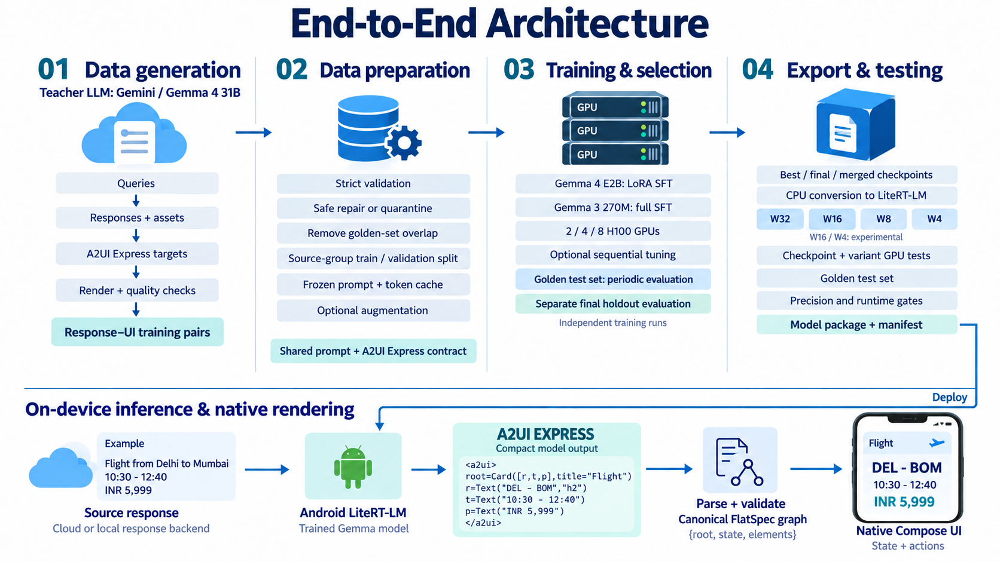

# A2UI Express single-slide architecture



[Download the slide image](assets/a2ui_system_architecture/04_a2ui_express_complete_pipeline_v3.png)

One landscape slide covering dataset generation, preparation, model training,
Golden-set evaluation, LiteRT-LM packaging, on-device inference, and native
Android rendering. The PNG is 1672 x 941 pixels, approximately 16:9, and can be
inserted directly into a widescreen presentation.

## Architecture scope

- Dataset generation uses a configurable teacher, including Gemini and Gemma 4
  31B routes. Queries, source responses/assets, and A2UI Express targets are
  separate generation stages, followed by rendering and quality checks.
- Preparation validates records, applies supported mechanical repairs or
  quarantine, removes benchmark overlap, splits source groups, and caches the
  frozen prompt/tokenization. Augmentation is optional.
- The current dense deployment workflow trains Gemma 4 E2B with LoRA SFT or
  Gemma 3 270M with full SFT in independent runs. Training supports 2, 4, or 8
  allocated H100 GPUs. Sequential hyperparameter screening is optional.
- Golden32 is used for periodic checkpoint and tuning selection. It contains
  32 occurrences from 31 unique sources; selection gives each unique source
  equal weight. Golden35 contains 35 unique cases and is a post-training
  holdout, never a tuning or model-selection input.
- Best, final, and merged checkpoints and each of W32/W16/W8/W4 packages are
  evaluated on both cohorts, giving 14 final result slots. Conversion is on
  CPU. Native LiteRT-LM tests require a working GPU runtime. W16/W4 remain
  experimental, and export/precision/runtime checks must pass for each format.
  The diagram describes the workflow, not measured success or quality scores.
- All selected GPUs participate in training. The built-in native LiteRT-LM
  runner uses a warm GPU engine; it does not claim multi-GPU distributed
  inference.
- The trained model maps an existing source response to A2UI Express. The
  response backend can be cloud or local and is separate from this UI model.
- Android parses and validates the Express DSL into its canonical FlatSpec
  graph, then renders native Compose components with state and actions.
  The example phone UI is illustrative, not a captured device result.
- Official E2B retained-scale QAT, GRPO, and MTP assistant workflows are separate
  contracts and are not presented as automatic steps of this dense deployment
  path. Their availability does not establish a jointly trained MTP assistant.

## Repository sources

Architecture checked against checkout
`44fa933a6a1ccb1e3112792944bfae4d27b56157` on 2026-09-16:

- [Dataset stages](../dataset/README.md)
- [Teacher model configurations](../dataset/configs/models.yaml)
- [Gemma 4 teacher launcher](../dataset/scripts/run_gemma4_dataset_stages.sh)
- [A2UI Express generation contract](../dataset/prompts/genui_gen_mobile_a2ui_express_v1.md)
- [Current GPU training, evaluation, and deployment flow](../training/docs/GOLDEN_GPU_DEPLOYMENT.md)
- [Deployment orchestration](../training/src/ir_training/pipeline/golden_deployment.py)
- [Training profiles](../training/src/ir_training/pipeline/golden_training.py)
- [Android on-device backend](../android/app/src/main/java/com/samsung/genuicraft/inference/OnDeviceLitertBackend.kt)
- [Android pipeline and validation](../android/app/src/main/java/com/samsung/genuicraft/pipeline/GenUiStagePipeline.kt)
- [Express codec](../android/app/src/main/java/com/samsung/genuicraft/pipeline/A2uiExpressCodec.kt)
- [Native renderer](../android/app/src/main/java/com/samsung/genuicraft/renderer/FlatSpecRenderer.kt)

## Revision 3 edit prompt

The header is now "End-to-End Architecture". The bottom row shows a consistent
illustrative Delhi-to-Mumbai flight response, compact A2UI Express Card/Text
program, and native flight card. Times and fare are fictional example data,
not a real flight quotation. The generic Golden test set wording and absence
of the TensorBoard/comparison-table bar are preserved.

Edited with the built-in image-generation tool using revision 2 as the edit
target. Previous images are retained unchanged.

```text
Use case: precise-object-edit.
Edit the supplied single-slide architecture image, using it as the edit target. Preserve its white background, navy/teal/blue palette, crisp type, landscape aspect ratio, four upper architecture columns, labels, icons, upper arrows, and the Deploy connector.

Make these two requested changes:

1. Replace the main title "A2UI Express: End-to-End Architecture" with exactly "End-to-End Architecture". It must be the only main header text. Keep it centered, large, and navy with comfortable margins. Keep A2UI Express named in the appropriate pipeline stages and in the code panel.

2. Replace the small trip-checklist example in the bottom runtime row with a richer, visually clear FLIGHT example that demonstrates the SAME data becoming a native UI:
- Retain the five-step runtime flow and labels: Source response; Android LiteRT-LM / Trained Gemma model; A2UI EXPRESS / Compact model output; Parse + validate / Canonical FlatSpec graph / {root, state, elements}; Native Compose UI / State + actions.
- At the left, reduce the cloud icon enough to add a readable illustrative source-response excerpt: "Flight from Delhi to Mumbai" then "10:30 - 12:40" then "INR 5,999". Label the excerpt "Example". Do not suggest this is a real live flight quotation.
- In the A2UI EXPRESS panel, replace the old code with EXACTLY this valid compact flight-card DSL, using readable monospaced text:
<a2ui>
root=Card([r,t,p],title="Flight")
r=Text("DEL - BOM","h2")
t=Text("10:30 - 12:40")
p=Text("INR 5,999")
</a2ui>
- Replace the empty checklist phone screen with a polished native Android flight-card illustration. Make the phone slightly larger if needed for legibility. Show a clean white screen with a soft blue/teal card, heading "Flight", prominent route "DEL - BOM", time "10:30 - 12:40", and bold fare "INR 5,999". A small understated aircraft motif is welcome as a visual cue, but do not add extra flight facts or buttons not in the DSL. The UI should have meaningful typographic hierarchy, padding, and aligned content so it is clearly a native rendered card, not plain lines dumped on a screen.
- Keep all three flight data representations consistent. Remove every occurrence of "Trip checklist" and "Passport ready".
- Only rebalance the lower runtime row as needed to make the example readable. Keep its flow left to right and its arrows clear of labels. All bottom captions must stay within the canvas.

Important invariants: preserve every upper-column label and its meaning; retain generic "Golden test set" wording and "Separate final holdout evaluation"; do not reintroduce Golden32, Golden35, TensorBoard, or a comparison-table bar. Preserve the complete on-device pipeline and the visible A2UI EXPRESS name. No extra title, footer, watermark, logos, or unrelated decorations. This is the same architecture slide with a shorter header and a better flight example, not a redesign.
```

## Revision 2 edit prompt

The revised image uses the generic label "Golden test set" instead of numbered
cohort names and removes the TensorBoard/comparison-table bar. The detailed
cohort roles below remain repository documentation, not labels on the slide.
The original image is retained unchanged. This is a presentation-only edit;
training, evaluation, and logging behavior have not changed.

Edited with the built-in image-generation tool using the original PNG as the
edit target.

```text
Edit the supplied A2UI architecture slide. Use the image as the edit target, not merely as inspiration. Make only these localized changes, preserving the original 16:9 composition, typography, colors, all icons, all other text, and every other connector:

1. In column 03, replace "Golden32: periodic model selection" with "Golden test set: periodic evaluation". Keep the text comfortably readable within its existing blue row.
2. In column 03, replace "Golden35: final holdout only" with "Separate final holdout evaluation". This preserves the distinction between model selection and the final held-out evaluation without naming dataset sizes.
3. In column 04, replace "Golden32 + Golden35" with exactly "Golden test set".
4. Completely remove the long pale blue bar reading "TensorBoard /tensorboard/ + final comparison tables", including its text and the two short downward arrows feeding it from columns 03 and 04. Restore clean white space there. Preserve the thin horizontal divider below this area, and especially preserve the separate long "Deploy" arrow routing from "Model package + manifest" to the Android LiteRT-LM model.

There must be no occurrences of Golden32, Golden35, Golden 32, Golden 35, TensorBoard, /tensorboard/, or final comparison tables anywhere in the edited slide. Keep all remaining content unchanged, including the main title, Gemma model labels, W32/W16/W8/W4 formats, A2UI EXPRESS code example, and the on-device inference flow. Do not add any new text, headings, or decorations.
```

## Initial generation prompt (revision 1)

Created with the built-in image-generation tool, not the CLI fallback.
The image is a raster slide, not an editable PowerPoint diagram.

```text
Use case: infographic-diagram.
Asset type: one presentation slide image, 16:9 landscape, high resolution, ideally 3840x2160.
Create a polished technical architecture diagram for the A2UI project, for a mixed engineering and leadership audience. Use crisp highly readable typography, white background, deep navy headings, restrained teal and blue accents. Large, simple semantic icons for teacher/cloud, dataset, GPUs, model package, and Android phone. A single flat coherent flow composition, not a dashboard, not a grid of rounded cards. No photographs, no invented logos, no decorative 3D, no watermark. Keep generous margins and whitespace. Fine straight arrows must never run across text. Keep all technical text exact and easy to read at presentation scale. Do not add extra prose.

Title at top, largest text:
"A2UI Express: End-to-End Architecture"

Upper section occupies about 58% of the content area, with four evenly spaced stages connected left to right. Each stage has a large numbered heading, one simple icon, and a short neatly aligned text group. Text below is verbatim, line breaks can be adjusted. Use concise text without bullet dots.

Stage 1 heading: "01  Data generation"
Subheading: "Teacher LLM: Gemini / Gemma 4 31B"
Show a miniature vertical flow using these four separate labels:
"Queries"
"Responses + assets"
"A2UI Express targets"
"Render + quality checks"
Small output label: "Response–UI training pairs"

Stage 2 heading: "02  Data preparation"
Labels:
"Strict validation"
"Safe repair or quarantine"
"Remove golden-set overlap"
"Source-group train / validation split"
"Frozen prompt + token cache"
"Optional augmentation"

Stage 3 heading: "03  Training & selection"
Labels:
"Gemma 4 E2B: LoRA SFT"
"Gemma 3 270M: full SFT"
"2 / 4 / 8 H100 GPUs"
"Optional sequential tuning"
"Golden32: periodic model selection"
"Golden35: final holdout only"
Make Golden35 distinct from model selection, not an input to tuning. A tiny note underneath may say "Independent training runs".

Stage 4 heading: "04  Export & testing"
Labels:
"Best / final / merged checkpoints"
"CPU conversion to LiteRT-LM"
A clear row of four weight-format labels: "W32"  "W16"  "W8"  "W4"
"Checkpoint + variant GPU tests"
"Golden32 + Golden35"
"Precision and runtime gates"
"Model package + manifest"
A small but readable qualifier near weight formats: "W16 / W4: experimental"

Under stages 3 and 4, a thin connected reporting rail, not a separate big panel:
"TensorBoard /tensorboard/ + final comparison tables"
Show that this receives metrics from training and evaluation.

Lower section starts with heading "On-device inference & native rendering" and uses one clear left-to-right runtime flow:
1. "Source response" with sublabel "Cloud or local response backend"
2. "Android LiteRT-LM" with sublabel "Trained Gemma model"
3. "A2UI EXPRESS" large teal heading with sublabel "Compact model output" and this exact small monospaced example on a pale teal background:
<a2ui>
root=Column([a,b])
a=Text("Trip checklist","h2")
b=Text("Passport ready")
</a2ui>
4. "Parse + validate" then "Canonical FlatSpec graph" with small line "{root, state, elements}"
5. A clean Android phone illustration with a native UI reading "Trip checklist" and "Passport ready". Below the phone: "Native Compose UI" and "State + actions".

Connect the upper-right model package to the Android LiteRT-LM node using a tidy orthogonal arrow routed in the whitespace between sections, labeled "Deploy". It must feed the model, not bypass inference into the final phone.
A modest shared-contract label between preparation and runtime reads "Shared prompt + A2UI Express contract".
Architecture invariants: Stage 2 creates the source response and is separate from the trained Stage 3 response-to-UI model. A2UI Express is the generated DSL; FlatSpec is the internal renderer graph. The phone renders native UI, not a webpage. Golden sets are excluded from training and validation. Golden35 never tunes/selects a model. GPU training spans allocated GPUs, but do not imply native LiteRT inference is distributed across 8 GPUs. Export is CPU, native validation is GPU. Do not invent scores, throughput numbers, passing test claims, or successful deployment claims.
Prioritize clean, beautiful editorial technical-diagram layout and readable exact text over ornament. All required sections must fit in this single 16:9 slide.
```
