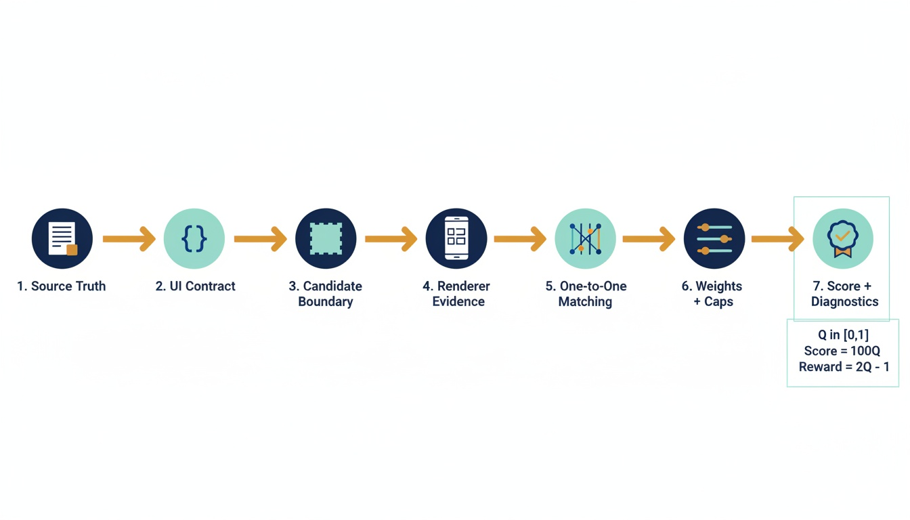
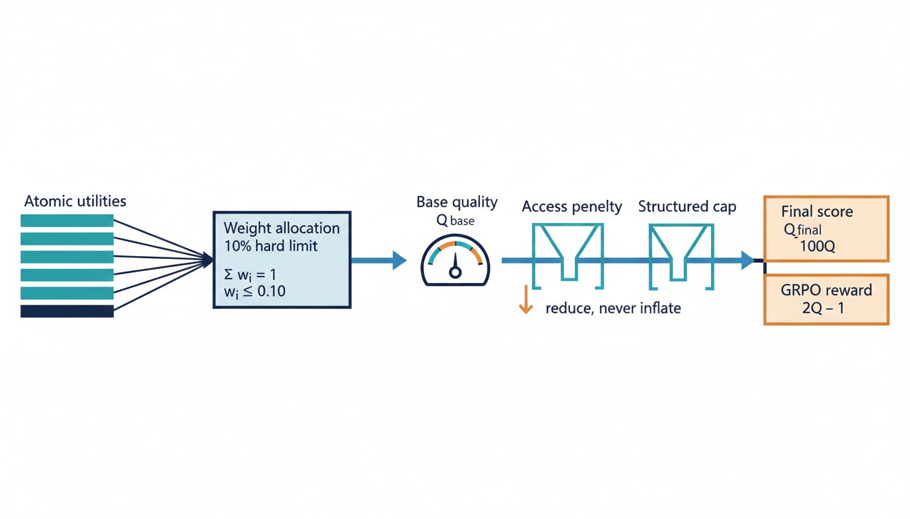
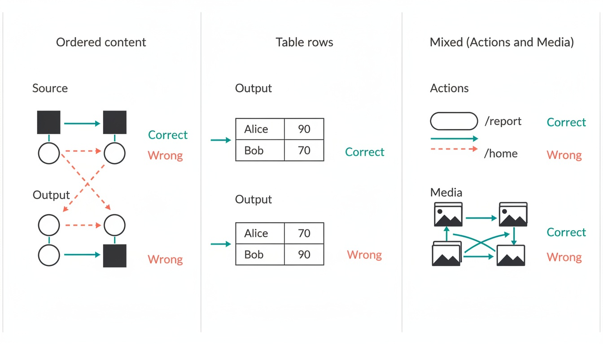
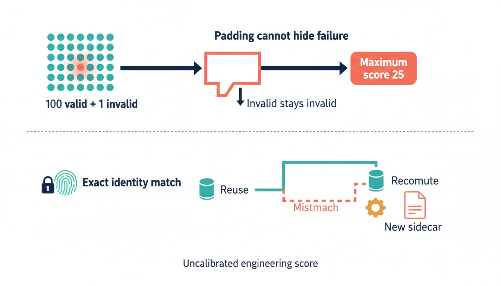

# GenUI Representation Quality v5.4 — a simple explanation

## The short version

GenUI Representation Quality v5.4 measures one thing:

> How well does generated FlatSpec JSON preserve the supplied source response as
> a UI that the Android renderer can understand?

It does **not** judge whether the source response is true, helpful, or well
written. The source is treated as the reference truth.

The metric is stronger now because it:

- checks the same canonical representation used by the production pipeline;
- follows the real renderer graph from the declared root;
- preserves order and relationships instead of counting loose words;
- matches actions, media, charts, tables, and other roles one-to-one;
- prevents one easy metric from dominating the final score;
- applies hard caps to serious failures that cannot be hidden by padding;
- records fingerprints and hashes so stale scores are recomputed; and
- returns full evidence, not just one unexplained number.

The result is a deterministic, bounded engineering score that is suitable for
offline comparisons and GRPO reward computation. It is still **uncalibrated**:
87 does not yet mean “87% human quality.”

## How one sample is scored



1. **Source truth:** Start with the response text, intent, and relevant assets.
2. **UI contract:** Extract what the source actually requires: ordered content,
   exact values, tables, actions, media, charts, forms, headings, code,
   formulas, email structure, and logs.
3. **Candidate boundary:** Parse the completion, canonicalize it through the
   production FlatSpec contract, run strict schema validation, and validate
   renderer references.
4. **Renderer evidence:** Walk only from `spec.root`. Unreachable components do
   not earn credit. Tabs, Modal, Repeat templates, state bindings, tables,
   charts, media, actions, and bounded dynamic expressions use shared
   renderer-aware semantics.
5. **One-to-one matching:** Match each required source item to at most one
   candidate item.
6. **Weights and caps:** Combine applicable atomic metrics under a hard
   anti-domination rule, then apply penalty-only accessibility and structured
   failure caps.
7. **Outputs:** Return the score, GRPO reward, dimensions, atomic evidence,
   active caps, effective weights, errors, performance data, and immutable
   identity hashes.

This shared path is used by Stage 3, offline scoring, aggregation, rescoring, and
GRPO. A caller cannot obtain a different semantic score merely by
canonicalizing the same completion first.

## The exact headline math



Each applicable atomic metric has a utility \(u_i\) between 0 and 1.

First calculate its nominal budget:

\[
p_i = D_{d(i)} \times A_i
\]

where:

- \(D_{d(i)}\) is the configured weight of the atomic's dimension; and
- \(A_i\) is the atomic's weight inside that dimension.

Then use capped proportional water-filling:

\[
w_i = \min(0.10,\lambda p_i)
\]

\[
\sum_i w_i = 1
\]

The solver chooses \(\lambda\). The important guarantee is:

\[
0 \le w_i \le 0.10
\]

No ordinary atomic metric can move the base score by more than 10 percentage
points. If there are too few applicable atomics to satisfy this rule, the
metric fails closed instead of silently breaking the guarantee.

The base quality is:

\[
Q_{\text{base}} = \sum_i w_i u_i
\]

Accessibility is penalty-only:

\[
Q_{\text{accessible}} =
Q_{\text{base}}
\left(1-\alpha(1-A)\right),
\qquad \alpha \le 0.03
\]

where \(A\) is accessibility conformance. Good accessibility does not create
extra quality; failures can reduce quality by at most the configured amount.

The artifact and generation surfaces are:

\[
Q_{\text{artifact}} =
\min\left(Q_{\text{accessible}}, C_1,\ldots,C_k\right)
\]

\[
Q_{\text{generation}} =
\min\left(Q_{\text{accessible}}U_{\text{raw}}, C_1,\ldots,C_k\right)
\]

Here:

- \(C_1,\ldots,C_k\) are applicable structured caps; and
- \(U_{\text{raw}}\le1\) is a small generation-only JSON-envelope utility.

Finally:

\[
\text{quality}_{0-100}=100Q
\]

\[
r_{\text{GRPO}}=2Q_{\text{generation}}-1
\]

The GRPO reward is therefore always between -1 and +1.

### A worked example

Assume an illustrative sample has ten applicable atomic metrics, each with an
effective weight of 0.10. Their utilities average to 0.84:

\[
Q_{\text{base}}=0.84
\]

If accessibility conformance is 0.90 and \(\alpha=0.03\):

\[
Q_{\text{accessible}}
=0.84\left(1-0.03(1-0.90)\right)
=0.83748
\]

Now suppose a required action is missing. The configured missing-action cap is
0.75:

\[
Q=\min(0.83748,0.75)=0.75
\]

So:

- dashboard score = \(100\times0.75=75\);
- GRPO reward = \(2\times0.75-1=0.50\).

This is deliberate. Strong prose and layout cannot compensate for a required
action that the user cannot perform.

## What the dimensions mean

The configuration starts from these expert-prior dimension weights:

| Dimension | Nominal weight | Plain-English question |
|---|---:|---|
| Integrity | 25% | Is this valid, rooted, connected, renderer-compatible FlatSpec? |
| Fidelity | 40% | Does visible UI content preserve the source's words, values, order, tables, actions, and media? |
| Semantic mapping | 15% | Did the output use the right UI roles for the source? |
| Hierarchy | 10% | Is information grouped and structured sensibly? |
| Economy | 7% | Is the representation concise without duplication or useless wrappers? |
| Accessibility | penalty-only, up to 3% | Do applicable controls and content meet renderer-aware accessibility checks? |

These are nominal budgets, not a promise that every sample has the same
effective dimension shares. Inapplicable atomics are removed, and the global
water-filling solver reallocates the applicable budgets while enforcing the
10% per-atomic limit. Every result records the effective atomic and dimension
weights that were actually used.

## Meaning matters more than loose token overlap



### Ordered content

Source units and visible output blocks are matched one-to-one. The pair
similarity is:

\[
\operatorname{sim}(s,o)=
0.45F_2(\text{unigrams})+
0.35F_1(\text{bigrams})+
0.20\operatorname{LCSNorm}(s,o)
\]

This rewards coverage, local phrasing, and order. The metric also scores the
order of the matched blocks separately.

Example:

- Source: “First verify the account. Then transfer the funds.”
- Wrong output: “Transfer the funds. Then verify the account.”

Most words are identical, but the relationship is wrong. The new metric lowers
the order score.

### Tables keep row and column relationships

Consider this source table:

| Person | Score |
|---|---:|
| Alice | 90 |
| Bob | 70 |

This candidate is wrong:

| Person | Score |
|---|---:|
| Alice | 70 |
| Bob | 90 |

A flattened bag of cells sees the same four values. v5.4 aligns columns, assigns
rows one-to-one, and compares associated cells. Swapping the values therefore
reduces table fidelity.

### Actions require the right destination

A required action is matched using:

> normalized label + action type + normalized target

If the source requires **Open report → `/report`**, a button that opens
`/home` does not satisfy the requirement. Extra actions also affect precision.

### Media and roles are one-to-one

One image cannot satisfy two different required images. Three duplicate charts
cannot satisfy three distinct chart requirements. Candidate reuse is blocked,
and duplicate semantic signatures have explicit capacity.

Optional entries remain optional. If a contract item has `required: false`,
omitting it does not activate a missing-item cap.

## Serious failures cannot be averaged away



Validity is authoritative, not an average over components.

| Failure | Maximum quality |
|---|---:|
| Parse failure or non-object | 0 |
| Missing declared root | 10 |
| Production-invalid candidate | 25 |
| Missing reference or rooted cycle | 25 |
| Reachability below 90% | 40 |
| Strict-format violation on an otherwise canonicalizable candidate | 95 |

For example, one unsupported reachable type among 100 valid nodes still
activates the production-invalid cap. Adding more valid nodes cannot push that
candidate above 25.

Semantic caps protect source-required behavior too:

| Missing requirement | Maximum quality |
|---|---:|
| Required table | 65 |
| Required action | 75 |
| Required chart | 78 |
| Required media | 78 |
| Required special role | 78 |

Partial coverage uses less severe caps. This makes the score
non-compensatory where it matters: cosmetic quality cannot fully hide a missing
required capability.

## Renderer alignment

The scorer does not pretend to be a second full UI renderer. Instead, it shares
the renderer's reference semantics and audits the behavior that matters for
evidence.

Important examples include:

- traversal from the declared root only;
- `children`, templates, Repeat, Tabs, and Modal references;
- missing references, parent counts, rooted cycles, and root distance;
- Table columns, rows, state paths, and bindings;
- Chart series, axes, categories, values, and numeric parsing;
- Image, Video, and Audio source lookup;
- action objects, targets, state paths, forms, and labels; and
- bounded `$state`, `$item`, and `$index` interpretation for Repeat evidence.

Unreachable components, invisible unbound state, and renderer-inert metadata do
not create positive evidence. Unsupported dynamic expressions are reported as
unknown and can activate a cap; they are not silently treated as correct.

## Reproducible rescoring and stale-score detection

Every v5.4 result carries:

- metric and reward-pipeline fingerprints;
- source hash;
- raw candidate hash;
- canonical candidate hash;
- expected-contract hash;
- policy and extractor versions; and
- render-evidence identity.

A stored score is reused only when all relevant identities match exactly. A
changed config, schema, scoring module, renderer-semantics inventory, prompt,
source, candidate, contract, or render result makes the old score stale.

The correct response is:

1. recompute the sample;
2. write a new immutable sidecar; and
3. preserve the historical v4/v5 output.

This prevents a dashboard from presenting an old number as if it were produced
by the current metric.

## Why this is a good production engineering metric now

The strongest reasons are:

1. **The target construct is narrow and clear.** It measures source-to-rendered
   representation quality, not source factuality or writing quality.
2. **Validity is non-dilutable.** Padding cannot hide unsupported reachable
   types, missing roots, broken references, or cycles.
3. **Associations are preserved.** Order, table row membership, action targets,
   and distinct media/role instances affect the score.
4. **No single easy metric dominates.** Effective atomic weight is capped at
   0.10 at runtime.
5. **Applicability is honest.** N/A does not receive free perfect credit, and
   optional requirements remain optional.
6. **Renderer semantics are shared.** Contract validation, graph traversal, and
   evidence extraction do not maintain competing reference inventories.
7. **Dynamic UI patterns receive bounded credit.** Repeat/template
   representations can be compared fairly with equivalent static expansion.
8. **All paths agree.** Stage 3, offline evaluation, aggregation, rescoring, and
   GRPO use the same normalization and semantic scoring path.
9. **The result is auditable.** Effective weights, dimensions, atomics, caps,
   matching evidence, hashes, errors, and timings are returned with the score.
10. **Historical meaning is preserved.** v5.4 has its own immutable version and
    fingerprint instead of silently changing v4 or an earlier v5 definition.

## Current GPT-5.4 rescore

The latest v5.4 rescore covered 128 complete GPT-5.4 Stage 3 samples:

| Variant | Samples | Previous legacy aggregate | v5.4 mean | Change |
|---|---:|---:|---:|---:|
| Mini, no reasoning | 32 | 87.04 | 87.06 | +0.02 |
| Mini, medium reasoning | 32 | 81.86 | 88.91 | +7.05 |
| Standard, no reasoning | 32 | 95.41 | 85.76 | -9.65 |
| Standard, medium reasoning | 32 | 100.00 | 87.30 | -12.70 |
| **Combined** | **128** | **91.08** | **87.26** | **-3.82** |

Combined v5.4 distribution:

- median: 89.40;
- standard deviation: 8.87;
- 5th–95th percentile: 74.68–96.99; and
- range: 40.00–98.18.

The lower scores for previously near-perfect variants are a healthy sign, not
proof that the generated UIs became worse. The old aggregate and v5.4 do not
measure exactly the same construct. v5.4 is harder to inflate with structural
richness and more sensitive to missing or incorrect source-required semantics.

The detailed immutable result is in
[`aggregates_v2.json`](../dataset/data/runs/azure_gpt54_reasoning32_20260618_214045/aggregates_v2.json).

## Verification evidence

The focused v5.4 metric, pipeline, renderer, semantic-role, and FlatSpec
contract suite currently passes:

```text
41 passed in 3.27s
```

The tests cover the production boundary, renderer-reference parity,
non-dilutable validity, one-to-one role behavior, Stage 3/GRPO agreement,
fingerprints, stale-score handling, and bounded deterministic outputs.

The source data hashes were checked during rescoring, and the same metric
fingerprint was used across all four completed GPT-5.4 variants:

```text
a8e7ff31bd38c758d340e8204ea292797e18e9872ef0165941594ca9f68f6079
```

## What we should still not claim

This metric is ready as a deterministic engineering measure and reward signal,
but three boundaries remain important:

- **No human calibration yet.** The 0–100 value is not an equal-interval human
  quality percentage. Initial weights and thresholds are expert priors.
- **Python evidence is not a native render.** Native Android render success or
  failure must come from an attempted Android render and is recorded
  separately.
- **The source is reference truth.** The metric intentionally does not detect
  factual errors or poor writing in the source response.

The next validation layer should use rendered, same-source human preference
data and frozen mutation benchmarks. That work can calibrate interpretation
without changing what the metric is designed to measure.

## A 60-second explanation

> The new GenUI metric checks whether our JSON faithfully turns the supplied
> response into a renderer-compatible UI. It starts from the source, extracts
> required content and behavior, canonicalizes the candidate through the
> production contract, and follows the same kinds of references the Android
> renderer follows. It matches content, tables, actions, media, and semantic
> roles one-to-one, so the same image cannot satisfy two requirements and a
> wrong action target does not count. Each atomic metric is capped at 10% of the
> base score, while serious failures such as invalid types, broken references,
> or missing required actions apply hard score ceilings. Every result includes
> evidence and fingerprints, so stale scores are recomputed. This makes v5.4 a
> much safer deterministic engineering score and GRPO reward. It is not yet a
> human-calibrated quality percentage, and we say that explicitly.

## Authoritative references

- [`genui_metric_v5_4.yaml`](../dataset/configs/genui_metric_v5_4.yaml)
- [`genui_metric_v5_4_runbook.md`](genui_metric_v5_4_runbook.md)
- [`_v5_4.py`](../dataset/src/pipeline/genui_quality/_v5_4.py)
- [`aggregate_v5_4.py`](../dataset/src/pipeline/genui_quality/aggregate_v5_4.py)
- [`renderer_effective_semantics_v5_4.py`](../dataset/src/pipeline/renderer_effective_semantics_v5_4.py)
- [`FlatSpecRenderer.kt`](../android/app/src/main/java/com/samsung/genuicraft/renderer/FlatSpecRenderer.kt)

## Diagram-generation note

The diagrams were generated through PaperBanana using:

- main planner/critic model: `gemini-3.1-pro-preview`;
- requested Pro image model: `gemini-3-pro-image-preview`;
- actual image fallback: `gemini-2.5-flash-image`, because the configured
  Vertex Express project returned `404 NOT_FOUND` for the Pro image endpoint;
- auth route: Vertex AI Express;
- candidates: 1 per accepted figure;
- pipeline: `demo_planner_critic`;
- retrieval: `none`, because the optional PaperBananaBench reference bundle was
  absent; and
- critic rounds requested: 3 per accepted figure.

Observed critic rounds were 1 for the accepted pipeline figure and 3 each for
the accepted math, semantic-matching, and safety/identity figures. All accepted
figures were visually reviewed for label, example, and formula accuracy.
